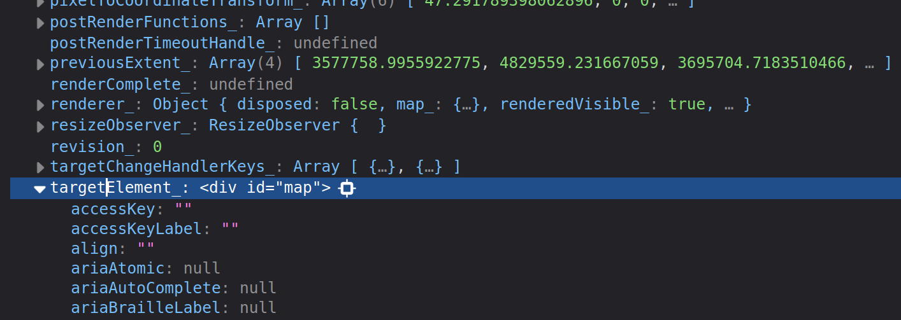
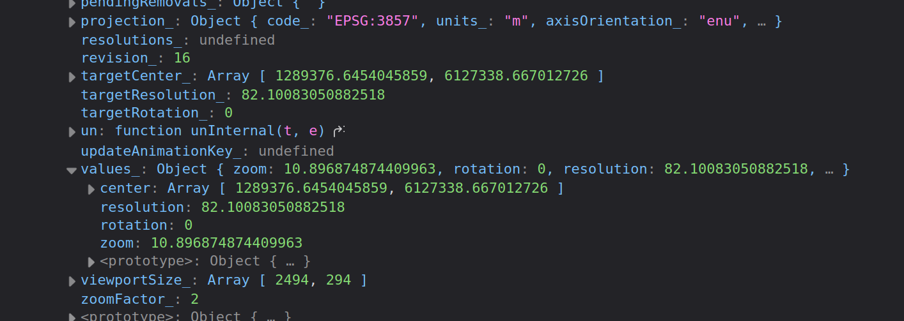
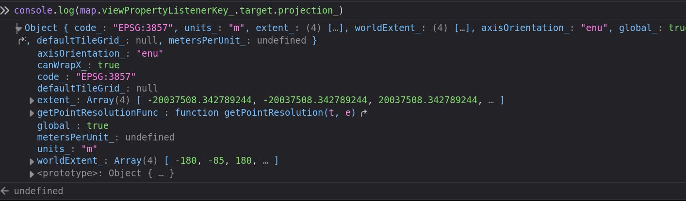
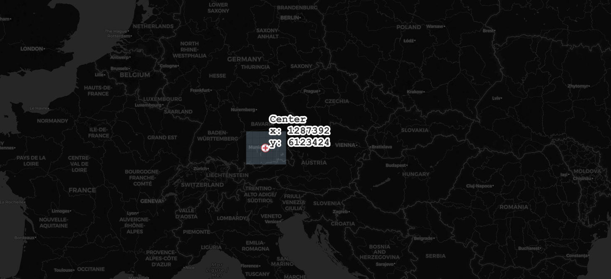
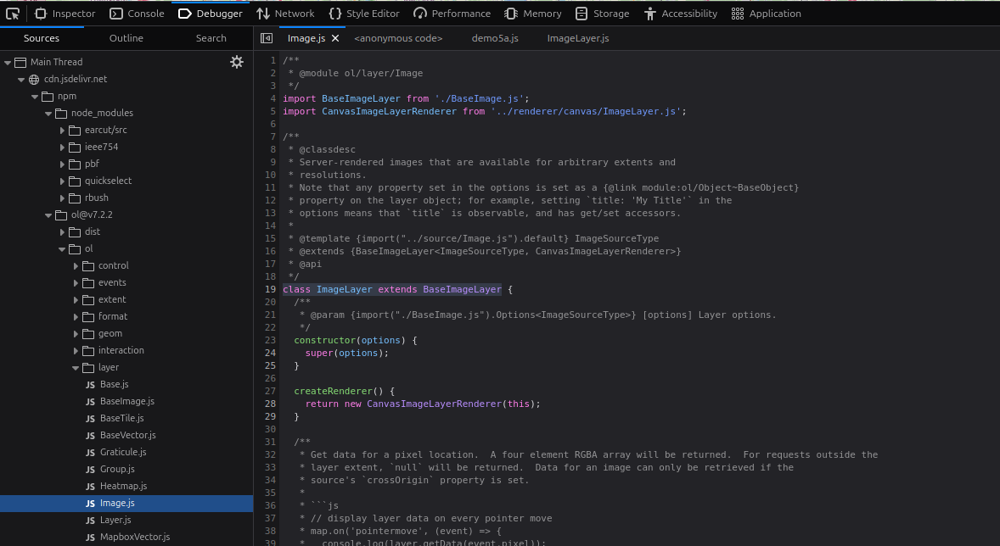
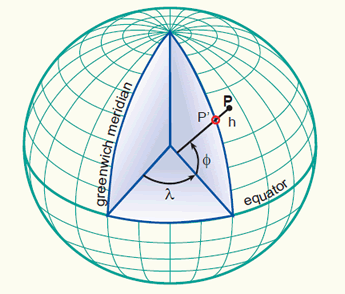
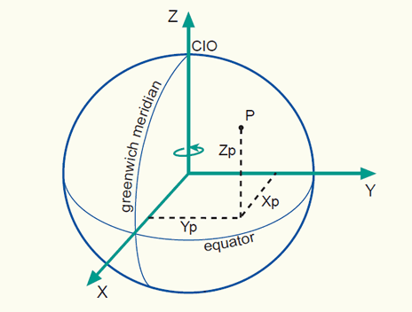

# Essentials of Web Mapping based on JavaScript Libraries


> Munich Technical University || Chair of Geoinformatics

> Murat Kendir, Prof. Thomas Kolbe || murat.kendir@tum.de

- In this document we will discuss concepts related to web mapping based on JavaScript libraries.
- Since all web mapping libraries used in this document are based on the JavaScript language, we will also partially discuss some basic concepts of JavaScript.


## 1) How to combine different sources in HTML?

- In an HTML document, you can combine different resources for use in the web interface.
- Traditionally, files related to style, content and programs are stored in separate files and combined into one HTML file. One popular method of file separation is to use HTML (content), CSS (style) and Javascript (program) files.
- It should be noted that separation is not always the best method. Sometimes developers prefer to use them in a single HTML file.

### 1.a-b) Defining styles for HTML elements

<a href="../raw_codes/essentials_of_web_map/demo1a.html">Demo 1a</a>
```html
<title>My Web Page</title>
<div align="center">
    <h1>Welcome to my website!</h1>
    <p align="right">This is my first web page design.</p>
    <p align="left">I am still very excited to make this.</p>
</div>
```


<a href="../raw_codes/essentials_of_web_map/demo1b.html">Demo 1b</a>
```html
<title>My Web Page</title>
<style>
    h1 {text-align:center;}
    p {text-align:left;} 
</style>
<div>
    <h1>Welcome to my website!</h1>
    <p>This is my first web page design.</p>
    <p>I am still very excited to make this.</p>
</div>
```


### 1.c) Referencing to HTML elements

<a href="../raw_codes/essentials_of_web_map/demo1c.html">Demo 1c</a>
```html
<title>My Web Page</title>
<style>
    #title1 {text-align:center;}
    #paragraph1 {text-align:left;} 
    .right {text-align:right;}
</style>
<div>
    <h1 id="title1">Welcome to my website!</h1>
    <p class="right">This is my first web page design.</p>
    <p id="paragraph1">I am still very excited to make this.</p>
</div>
```

### 1.d) Referencing to HTML elements

<a href="../raw_codes/essentials_of_web_map/demo1d.html">Demo 1d</a>

```html
<title>My Web Page</title>
<style>
    #title1 {text-align:center;}
    #paragraph1 {text-align:left;} 
    .right {text-align:right;}
</style>
<div>
    <h1 id="title1">Welcome to my website!</h1>
    <p class="right">This is my first web page design.</p>
    <p id="paragraph1">I am still very excited to make this.</p>
    <p id="paragraph1" class="right">What an exciting moment.</p>
</div>
```

### 1.e) Importing Styles from an external file

<a href="../raw_codes/essentials_of_web_map/demo1e.html">Demo 1e</a>

```html
<title>My Web Page</title>

<link rel="stylesheet" href="my_style.css">

<div>
    <h1 id="title1">Welcome to my website!</h1>
    <p class="right">This is my first web page design.</p>
    <p id="paragraph1">I am still very excited to make this.</p>
    <p id="paragraph1" class="right">What an exciting moment.</p>
</div>
```

### 1.f) Importing Styles from an external file

<a href="../raw_codes/essentials_of_web_map/demo1f.html">Demo 1f</a>

```html
<title>My Web Page</title>

<link rel="stylesheet" href="https://www.neredekaliyor.com/koordinat_paylasma/my_style.css">

<div>
    <h1 id="title1">Welcome to my website!</h1>
    <p class="right">This is my first web page design.</p>
    <p id="paragraph1">I am still very excited to make this.</p>
    <p id="paragraph1" class="right">What an exciting moment.</p>
</div>
```

## 2.a) How to configure modern web sites using JavaScript libraries?

- Similar to CSS implementations, JavaScript code can be applied to HTML files using internal or external sources.
- Modern websites often combine multiple JavaScript libraries.

An Example: **ThreeJS**

- Not only for geospatial use cases, but also animations, 3D models etc.
- is base library of various geospatial JavaScript libraries (e.g. [three-geo](https://w3reality.github.io/three-geo/), [three-globe](https://vasturiano.github.io/three-globe/))
- Implemented into QGIS to use as 3D Visualizer
  - accessible through **View > 3D Map Views**

<a href="../raw_codes/essentials_of_web_map/demo2a.html">Demo 2a</a>

## 3.a) Web Map with OpenLayers

- OpenLayers is one of the most advanced 2D web map libraries.

<a href="../raw_codes/essentials_of_web_map/demo3a.html">Demo3a</a>

```html
<html>
  <head>
    <script src="https://cdn.jsdelivr.net/npm/ol@v7.2.2/dist/ol.js"></script>
    <link rel="stylesheet" href="https://cdn.jsdelivr.net/npm/ol@v7.2.2/ol.css">
    <title>Empty Map with defaults</title>
    <link rel="stylesheet" href="demo3a.css"></link>
  </head>
  <body>
    <div id="map"></div>
    <div class="box"> Check the style of this box. </div>
  <script type="text/javascript" src="demo3a.js"></script>
  </body>
</html>
```

### 3.b) Understanding the JavaScript code

```javascript
var map = new ol.Map({
    target: 'map',
    layers: [
      new ol.layer.Tile({
        source: new ol.source.OSM()})
    ],
    view: new ol.View({
      center: [1287392,6123424],
      zoom: 10
    })
  });
```

- var map --> defines a custom variable
- new ol.Map --> calls the **Map** class from the **ol** module.
  - target: 'map' --> sets target HTML element as "map"
  - layers: [] --> adds some layer to show in map object
    - new ol.layer.Tile() --> adds a layer as a tiled map
      - new ol.source.OSM() --> sets the source of the tile map as OSM
  - view: new ol.View() --> sets view as a new **View** object.

### 3.c) Finding the elements of a JavaScript object

- Type ```console.dir(map)``` in the (Web) Developer Tool of browser
- After finding the target element, you can print the content with ```console.log(map.targetElement_)```
- Search for the target, layers and view elements.



### 3.c) Finding the elements of a JavaScript object

- Try to find the specified map center coordinates ```console.dir(map)```
- Check ```console.log(map.viewPropertyListenerKey_.target.values_)```



### 3.d) State Diagram for a HTML Parsing Process (HTML+CSS+OpenLayers)


## 4.a) In which Coordinate Reference System (CRS)?

- Even if a custom CRS is not defined, the map has to be visualized based on a default CRS.
- Check ```console.log(map.viewPropertyListenerKey_.target.projection_)```
- Search with the EPSG code on [epsg.io](https://epsg.io) to learn more about it.



### 4.b) How about the Zoom Level?

- The zoom level is defined as 10 in the JavaScript code.
- Many web map applications are using the zoom level as one of the main map constructor.
  - e.g. [https://www.openstreetmap.org/#map=10/48.1038/11.6483](https://www.openstreetmap.org/#map=10/48.1038/11.6483)
- To learn and test the zoom levels in the same CRS, you can use some plugins in QGIS:
  - Set the CRS as **EPSG:3857 (Pseudo-Mercator)** in Map Properties
  - Search for "**Zoom Level**" and/or "**Layer Tiles Mapcanvas**" in Plugins Manager




### 4.c) Get the current zoom level and write to an HTML element

<a href="../raw_codes/essentials_of_web_map/demo4c.html">Demo4c</a>

```javascript
function onZoomEnd(evt) {
  const map = evt.map;
  var zoomInfo = 'Zoom level : \n' + map.getView().getZoom(); ;
  console.log(zoomInfo);
  document.getElementById('topright_box').innerHTML = zoomInfo;
}

map.on('moveend', onZoomEnd);
```


## 5.a) How to add WMS service to the OpenLayers?

Which one is a correct definition for a WMS service in OpenLayers?

<a href="../raw_codes/essentials_of_web_map/demo5a.html">Demo5a</a>

**A**
```javascript
new ol.layer.Image({
        source: new ol.source.ImageWMS({
          url: 'https://geoportal.muenchen.de/geoserver/gsm_wfs/awm_wertstoffhoefe_opendata/ows',
          params: {'LAYERS': 'awm_wertstoffhoefe_opendata'},
          }),
```

**B**
```javascript
new Image({
        source: new ImageWMS({
          url: 'https://geoportal.muenchen.de/geoserver/gsm_wfs/awm_wertstoffhoefe_opendata/ows',
          params: {'LAYERS': 'awm_wertstoffhoefe_opendata'},
          }),
```

### 5.b) How to detect the module hierarchy in a package?

Method 1: Check the debugger tool in (Web) Developer Tool.

Method 2: Check the documentation of the used library (e.g. [OpenLayers API Doc](https://openlayers.org/en/latest/apidoc/) ).



### 5.c) How to get feature info?

<a href="../raw_codes/essentials_of_web_map/demo5c.html">Demo5c</a>

- Check the GetFeatureInfo operation's documentation: [OGC e-Learning](http://opengeospatial.github.io/e-learning/wms/text/operations.html#getfeatureinfo)

- Check the following classes/methods in OpenLayers API Doc:
  - [Search for "on(type, listener)" method](https://openlayers.org/en/latest/apidoc/module-ol_Map-Map.html)
  - [Search for "getFeatureInfoUrl" method](https://openlayers.org/en/latest/apidoc/module-ol_source_ImageWMS-ImageWMS.html)

```javascript
map.on('singleclick', function (evt) {
  //console.log(evt);
  document.getElementById('topright_box').innerHTML = '';
  const viewResolution = view.getResolution();
  const url = wmsSource.getFeatureInfoUrl(
    evt.coordinate,
    viewResolution,
    'EPSG:3857',
    {'INFO_FORMAT': 'text/plain'},
  );
});
```

### 5.d) Display the feature information in a HTML element

<a href="../raw_codes/essentials_of_web_map/demo5c.html">Demo5c</a>

- If you are not familiar with some JavaScript functions or classes like 'let', 'const', 'Promise', check the documents for the 2015 JavaScript version (aka ECMAScript 6/ES6):
  - https://www.w3schools.com/Js/js_es6.asp

```javascript
map.on('singleclick', function (evt) {
  //console.log(evt);
  document.getElementById('topright_box').innerHTML = '';
  const viewResolution = view.getResolution();
  const url = wmsSource.getFeatureInfoUrl(
    evt.coordinate,
    viewResolution,
    'EPSG:3857',
    {'INFO_FORMAT': 'text/plain'},
  );
  if (url) {
    fetch(url)
      .then((response) => response.text())
      .then((html) => {
        document.getElementById('topright_box').innerHTML = html;
      });
  }
});
```

## 6.a) How to add WMTS layer to the OpenLayers?

[USGS WMTS service (Capabilities)](https://mrdata.usgs.gov/mapcache/wmts?service=wmts&request=getCapabilities)

- Which one is a correct definiiton for a WMTS connection?

**A**
```javascript
const my_wmts = new ol.layer.Tile({
                  opacity: 0.5,
                  source: new ol.source.WMTS({
                    url: 'https://mrdata.usgs.gov/mapcache/wmts',
                    layer: 'sgmc2',
                    width: '256px',
                    height: '256px',
                    format: 'image/png',
                  }),
                });
```

**B**
```javascript
const my_wmts = new ol.layer.Tile({
                  opacity: 0.5,
                  source: new ol.source.WMTS({
                    url: 'https://mrdata.usgs.gov/mapcache/wmts',
                    layer: 'sgmc2',
                    matrixSet: 'GoogleMapsCompatible',
                    format: 'image/png',
                  }),
                });
```

### 6.b) What are the resolution and MatrixSet IDs?

- Also check the EPSG:3857 (Pseudo-Mercator) extents : [EPSG.io](https://epsg.io/3857)

<a href="../raw_codes/essentials_of_web_map/demo6a.html">Demo6a</a>

```javascript
const projection = ol.proj.get('EPSG:3857');
const projectionExtent = projection.getExtent();
console.log('Projection Extent : ', projectionExtent);
const size = ol.extent.getWidth(projectionExtent) / 256;
console.log('Size : ' , size);
const resolutions = new Array(19);
const matrixIds = new Array(19);
for (let z = 0; z < 19; ++z) {
  // generate resolutions and matrixIds arrays for this WMTS
  resolutions[z] = size / Math.pow(2, z);
  matrixIds[z] = z;
}
```

### 6.c) Implementing the resolution and MatrixSet IDs with openlayers WMTS request

<a href="../raw_codes/essentials_of_web_map/demo6a.html">Demo6a</a>

```javascript
const my_wmts = new ol.layer.Tile({
                  opacity: 0.5,
                  source: new ol.source.WMTS({
                    url: 'https://mrdata.usgs.gov/mapcache/wmts',
                    layer: 'sgmc2',
                    matrixSet: 'GoogleMapsCompatible',
                    format: 'image/png',
                    projection: projection,
                    tileGrid: new ol.tilegrid.WMTS({
                      origin: ol.extent.getTopLeft(projectionExtent),
                      resolutions: resolutions,
                      matrixIds: matrixIds,
                    }),
                    style: 'default',
                    wrapX: false,
                  }),
                });
```

## 7.a) 3D Mapping with Cesium

- The existing base map options in CesiumJS need authorization (API token) to limit map requests (e.g. Bing Map)
- However, OpenStreetMap offers a tile basemap that does not require any authorization and can be used in CesiumJS.

```html
<html lang="en">
  <head>
    <title>Cesium Demo</title>
    <script src="../cesium/Build/Cesium/Cesium.js"></script>
    <link href="../cesium/Build/Cesium/Widgets/widgets.css" rel="stylesheet">
  </head>
<body style="width:100%;height:100%;">
   <div id="cesiumContainer"></div>
  <script>
    // Initialize the Cesium Viewer in the HTML element with the `cesiumContainer` ID.
    const viewer = new Cesium.Viewer('cesiumContainer', {
      //Use OpenStreetMaps
      imageryProvider : new Cesium.OpenStreetMapImageryProvider({
        url : 'https://a.tile.openstreetmap.org/'
      }),
    });      
  </script>
 </div>
</body>
</html>
```

### 7b) Converting local JS file references to cloud repository references

<a href="../raw_codes/essentials_of_web_map/demo7b.html">Cesium with online repositories</a>

- Usually online JS repositories provided in the documentation page of the library.
  - However, you can also check some known JS repositories such as [cdnjs](https://cdnjs.com), [jsdelivery](https://www.jsdelivr.com) etc.
  
```html
<html lang="en">
  <head>
    <title>Cesium Demo</title>
    <script src="https://cdnjs.cloudflare.com/ajax/libs/cesium/1.124.0/Cesium.js"></script>
    <link href="https://cdn.jsdelivr.net/npm/cesium@1.124.0/Build/Cesium/Widgets/widgets.min.css" rel="stylesheet">
  </head>
<body style="width:100%;height:100%;">
   <div id="cesiumContainer"></div>
  <script>
    // Initialize the Cesium Viewer in the HTML element with the `cesiumContainer` ID.
    const viewer = new Cesium.Viewer('cesiumContainer', {
      //Use OpenStreetMaps
      imageryProvider : new Cesium.OpenStreetMapImageryProvider({
        url : 'https://a.tile.openstreetmap.org/'
      }),
    });  
  </script>
 </div>
</body>
</html>
```

### 7.c) Camera Object

- Unlike 2D maps, 3D map environments need a camera object so that a scene selected on the map can be presented to the end user.

<a href="../raw_codes/essentials_of_web_map/demo7c.html">Cesium with camera initialization</a>

```javascript
// Fly the camera to San Francisco at the given longitude, latitude, and height.
    viewer.camera.flyTo({
      destination : Cesium.Cartesian3.fromDegrees(11.575,48.107, 4000),
      orientation : {
        heading : Cesium.Math.toRadians(0.0),
        pitch : Cesium.Math.toRadians(-45.0),
      }
    });
```

### 7.d) What is "Cartesian3"?





- Images taken from [https://kartoweb.itc.nl/geometrics/Coordinate%20systems/coordsys.html](https://kartoweb.itc.nl/geometrics/Coordinate%20systems/coordsys.html)

### 7.e) How the basemaps are loaded into Cesium (Tiling Mechanism)
 
- Visit the next demo page and try to give some tilt angle to the current view.
- Unfold the Cesium Viewer Inspector and find the Terrain group at the bottom.
- Enable the "Show Tile Coordinates" and the "Suspend LOD Update" options, then try zooming out.

- This is the basic 2D tiling mechanism that used to overlay 2D maps and terrain files.

<a href="../raw_codes/essentials_of_web_map/demo7d.html">Cesium with viewer Inspector</a>

### 7.f) How to add WMS service to the Cesium

- CesiumJS simply calculates the coverage area and tries to request for the WMS image by comparing with the current view area of the camera (frustum).

- Check the Capabilities of a found WMS service: [München Bezirksteil](https://geoportal.muenchen.de/geoserver/gsm_wfs/vablock_bezirksteil_opendata/ows?service=WMS&version=1.3.0&request=GetCapabilities)

<a href="../raw_codes/essentials_of_web_map/demo7f.html">Cesium with WMS service</a>

```javascript
// Add the main URL of WMS service
const geourl = 'https://geoportal.muenchen.de/geoserver/gsm_wfs/vablock_bezirksteil_opendata/ows?';
//Define the WMS service using available parameters
const geoWmsLayer = new Cesium.WebMapServiceImageryProvider({
      url : geourl,
      parameters: {
        service : 'WMS',
        format : 'image/png',
        transparent : true,
        },
      layers : 'vablock_bezirksteil_opendata',
        EPSG: '4326'
      });
//Add to the list of imagery layers of the current viewer.
viewer.imageryLayers.addImageryProvider(geoWmsLayer);
```

### 7.g) How to add default world terrain using Cesium Ion token

<a href="../raw_codes/essentials_of_web_map/demo7g.html">Cesium with Terrain</a>

- Create an account on Cesium Ion and generate a token specifically reserved for an application or limited in time.
- Add to the beginning of your CesiumJS code.

```javascript
//Change the token here below
Cesium.Ion.defaultAccessToken = "xyzabcxyzabcxyzabcxyzabcxyzabcxyzabcxyzabcxyzabcxyzabcxyzabcxyzabcxyzabcxyzabc";
```

- Go to Asset Manager in Cesium Ion web site and find the ID number ıf the world terrain.
- Than add the terrain by using its ID number as below.

```javascript
viewer.scene.setTerrain(
      new Cesium.Terrain(
        Cesium.CesiumTerrainProvider.fromIonAssetId(1),
        ),
    );
```


## 8.a) Adding 3D Tiles

<a href="../raw_codes/essentials_of_web_map/demo8a.html">Cesium with 3D Tiles</a>

- Add the main JSON link of the 3DTiles to Cesium 
  - e.g. [BaseMap.de - LOD2 Buildings](https://basemap.de/beta/beta-lod2/)

```javascript
var tileset = viewer.scene.primitives.add(new Cesium.Cesium3DTileset({
      url: 'https://web3d.basemap.de/cesium/buildings-fly/root.json'
    }));
```

- You can add attribute specific styles

```javascript
var cityStyle = new Cesium.Cesium3DTileStyle({
            color : {
                conditions : [
                   ["${surface} === 'wall'", "color('#f2f2f2')"],
                   ["${surface} === 'roof'", "color('#ff5c4d')"],
                   ["${surface} === 'bridge'", "color('#999999')"]
                ]
            },
         });
```

### 8.b) Enable Cesium 3DTiles Inspector

<a href="../raw_codes/essentials_of_web_map/demo8b.html">Cesium with 3D Tiles and Inspector</a>

```javascript
viewer.extend(Cesium.viewerCesium3DTilesInspectorMixin);
```
- Try to play with "Dynamic Screen Space Error" values
- Check the "Memory Usage" and the "Rendering Statistics"
