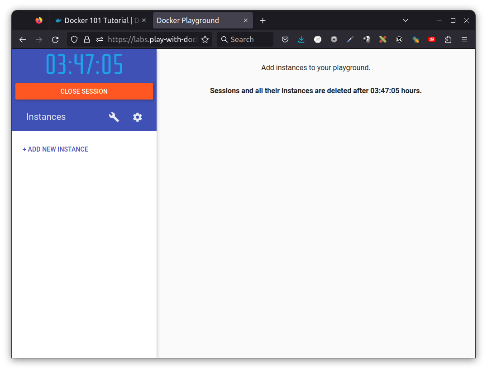
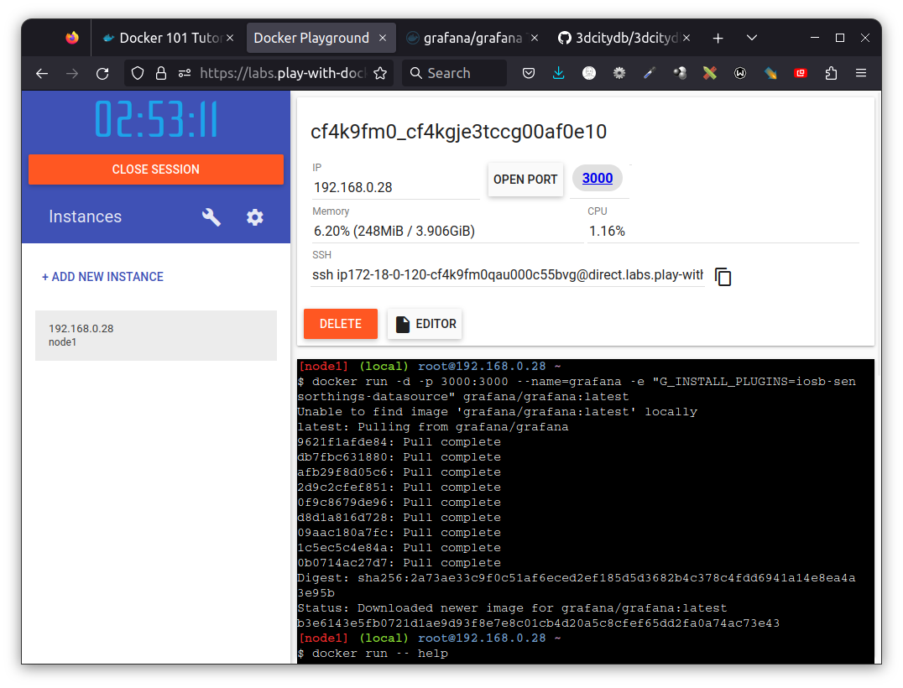
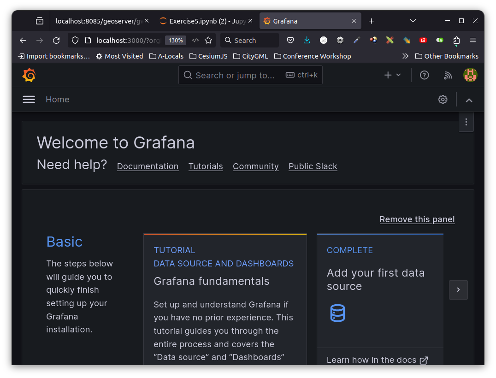

# Exercise - Docker Usage


<blockquote>
Munich Technical University || Chair of Geoinformatics </br></br>
Murat Kendir, Prof. Thomas Kolbe || murat.kendir@tum.de
</blockquote>

<div align="right" style="font-size:0.5em;">v. WiSe 2025-2026</div>

## Table of Contents

- [0. Aim of the Exercise](#0.-Aim-of-the-Exercise)
  - [0.1. General Preparation](#0.1.-General-Preparation)
  - [0.2. Cheatsheets](#0.2.-Cheatsheets)
  - [0.3. Play With Docker](#0.3.-Play-With-Docker)
- [1. First Practice on the Local Machine with Docker](#1.-First-Practice-on-the-Local-Machine-with-Docker)
  - [1.1. Docker Desktop Installation on Windows systems - Optional](#1.1.-Docker-Desktop-Installation-on-Windows-systems---Optional)
  - [1.2. Running Docker Container as an Instance](#1.2.-Running-Docker-Container-as-an-Instance)
  - [1.3. What actually happens after executing the "docker run" command?](#1.3.-What-actually-happens-after-executing-the-"docker-run"-command?)
  - [1.4. How to remove/delete docker images from the instance? - Optional](#1.4.-How-to-remove/delete-docker-images-from-the-instance?---Optional)
  - [1.5. Docker Cheatsheet and the Relevance between linux commands](#1.5.-Docker-Cheatsheet-and-the-Relevance-between-linux-commands)
  - [1.6. Access to the Grafana Dashboard](#1.6.-Access-to-the-Grafana-Dashboard)

## 0. Aim of the Exercise

This exercise primarily focuses on the usage of docker virtualization. You will practice with docker command line interface or the desktop application by running and inspecting some containers and images. In general, you will need to complete the following tasks:

- Learn how to use Docker using the given preparation materials.
- Run a **docker container** running the PlantUML Server on your own machine.
- Try to reach out to the server.

You can refer to the following resources when needed:

### 0.1. General Preparation

- [ ] Check the <a href="https://www.youtube.com/watch?v=rOTqprHv1YE" target="_blank">What is Docker and How it works?</a> video (16 min)
- [ ] Check the page <a href="https://www.docker.com/101-tutorial/" target="_blank">"Docker 101"</a> and follow the instructions below one of the options (Docker Desktop / Play with Docker) (~38 min).

### 0.2. Cheatsheets

- [ ] <a href="https://docs.docker.com/get-started/docker_cheatsheet.pdf" target="_blank">Docker CLI (Command Line Interface) Cheat Sheet</a>

### 0.3. Play With Docker

Open the following website:
[play-with-docker](https://labs.play-with-docker.com)
- [ ] Click to <mark>login</mark> and select <mark>docker</mark>
  - [ ] Register with your email account first if you do not have a docker hub account.
    - If the popup is blocked, disable the popup blocker and try again.
- [ ] Docker Playground will be launched and a session will be started which will be live for 4 hours.
- [ ] Click to <mark>Add New Instance</mark>
- [ ] An instance runtime will be started with a specific local ip address and ssh key.
- [ ] List the running docker containers by typing <mark>docker ps</mark> in the terminal screen (e.g. command prompt of the instance).
- [ ] If you want to check all (running and idle) available docker containers, type <mark>docker ps \-\- all</mark>
- [ ] Check all available commands: <mark>docker \-\- help</mark>
- [ ] If you want to check command-specific options and arguments, type <mark>docker any_command \-\- help</mark> (For exp. "docker ps --help")

> TIP: The terminal screen and available commands here will have the same or similar commands as a Linux terminal screen (command line), because usually the examples run on a Linux system. To check which version of Linux is used as the base operating system, type **uname -a** in the terminal.

<figure style="width:%100;text-align: center;">
  
  <figcaption>Play with Docker web site</figcaption>
</figure> 

## 1. First Practice on the Local Machine with Docker

### 1.1. Docker Desktop Installation on Windows systems - Optional


Check this step if you want to download and install the Docker Desktop or CLI tool on your personal computer

- If this is your first time downloading and installing Docker Desktop, it may be more effective to enable the **WSL2* option in Docker Settings.
- Search for "**Windows Properties**" and try to enable "**Windows Subsystem**". It is mandatory to enable **Hyper-V**. Hyper-V is a virtualization support that might be provided by your computer's CPU hardware. If it is not possible to enable it, you should check the BIOS configuration and look for a virtualization support option (it is usually on the "Advanced" page or tab).
- Enable Windows Subsystem 
- Click on the gear icon in the top right corner and go to **Resources \ WSL Integration**.
- At the first start of the Docker Desktop app, log in to Docker Hub using the Login button in the top right corner.
- You will continue using the CLI (Command Line Interface) tool, but you can still check the Desktop App to view the containers, images etc.


### 1.2. Running Docker Container as an Instance

- [ ] There is no working docker containers yet.
- [ ] Start a new docker container by typing:
    ```bash
    docker run -d -p 3000:3000 \
    --name=grafana \
    -e "GF_INSTALL_PLUGINS=iosb-sensorthings-datasource" \
    grafana/grafana:latest
    ```
  - Explanations of options and arguments:
    -  <mark>\-d or \-\-detach</mark> : The container continues to run in the background.
    - <mark>\-p or \-\-publish</mark> : Forward (Publish) a port in the container to the host (Left side shows the port of the host machine and right side of the column shows the port of the container)
    - <mark>\-e or \-\-env</mark> : Sets environment variables
    - <mark>\-\-name (no alias)</mark>: Assign a name to the container, to easily recognize containers.
    - <mark>grafana\/grafana:latest</mark> means "publisher\/image:anyTag" : The last argument is the full name of the docker image. Usually, tags include version numbers.
- [ ] Check the available docker containers by typing <mark>docker ps</mark>

### 1.3. What actually happens after executing the "docker run" command?

- The Docker app checked if the requested image (grafana/grafana:latest) already exists in our host machine. 
- If it is not available, it tries to download it from **Docker Hub** by searching for the same image name.

- [ ] Visit the Docker Hub page and search for our image manually:
  - https://hub.docker.com
- You can optionally search for any docker image on the command line:
  - <mark>docker search grafana</mark>
- Check the available docker images in the host machine:
  - <mark>docker image ls</mark>



### 1.4. How to remove/delete docker images from the instance? - Optional

- [ ] Try deleting the image:
  - <mark>docker rmi grafana/grafana:latest</mark>
- [ ] When an image is referenced to a container, the terminal will show an error and the container may still be running. So what we need to do is first stop the running container and then remove the referenced container:
  - <mark>docker stop \<CONTAINER_NAME\></mark>
  - or alternatively use the container ID shown in
    - Type <mark>docker container list</mark> (same as "ps" command) to see container IDs and names.
    - <mark>docker stop \<CONTAINER_ID\></mark>
- [ ] Check existing containers with the -all option:
  - <mark>docker ps \-\-all</mark>
- [ ] Remove the container:
- <mark>docker rm grafana</mark>
  - or alternatively with Container ID:
    - <mark>docker rm 829224beac3f</mark> (container IDs are not fixed numbers, try find your container's ID and replace with given one)
- [ ] Finally, remove the image from your instance:
  - <mark>docker rmi grafana\/grafana:latest</mark>

### 1.5. Docker Cheatsheet and the Relevance between linux commands

Many command abbreviations are inherited from Linux/Unix-based systems. These long command names can be used, for example, to make it easier to memorize abbreviated commands:
- cp : Copy
- rm : Remove
- exec : Execute
- cd : Change Directory
- ls : List
- ps : Processes
- diff : Difference

> TIP: However, one of the best ways to learn these commands is not to memorize them but to use a "Cheatsheet" document as an aid during the exercises. If you want to use such a document, visit this page: [Docker CLI Cheat Sheet](https://docs.docker.com/get-started/docker_cheatsheet.pdf)

### 1.6. Access to the Grafana Dashboard

- [ ] If you have already removed the container and image while following the instructions in section 1.4, start from scratch and start the docker container with the same command given earlier:
  - <mark>docker run -d -p 3000:3000 --name=grafana \-e "GF_INSTALL_PLUGINS=iosb-sensorthings-datasource" grafana/grafana:latest</mark>
- [ ] Now click the **Open Port** button at the top of the page and specify port **3000**. If your forwarded/published port is different, check the actual port number by typing <mark>docker ps</mark>.
- [ ] Type "admin" as username and password.
- [ ] Grafana will ask for a new password on the next page, type any password.
- If everything is OK, the Grafana start page will be shown.


