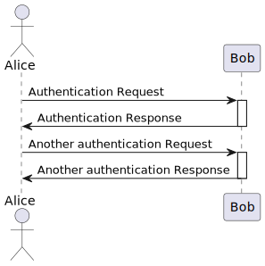

# Exercise - Distributed Systems & System Arcihtectures


<blockquote>
Munich Technical University / Chair of Geoinformatics <br> 
Murat Kendir*, Jicang Zhu, Prof. Thomas Kolbe <br> 
murat.kendir@tum.de
</blockquote>

<div align="right" style="font-size:0.5em;">v. WiSe 2025-2026</div>

## Table of Contents

- [0. Aim of the Exercise](#0.-Aim-of-the-Exercise)
  - [0.1 General Preparation](#0.1-General-Preparation)
  - [0.2 Cheatsheets](#0.2-Cheatsheets)
- [1. Technical Diagrams and UML](#1.-Technical-Diagrams-and-UML)
  - [1.1. How to draw a Sequence Diagram using PlantUML](#1.1.-How-to-draw-a-Sequence-Diagram-using-PlantUML)
    - [1.1.1. Sample PlantUML Code](#1.1.1.-Sample-PlantUML-Code)
  - [1.2. How to draw a sequence Diagram using Draw.io? - Optional](#1.2.-How-to-draw-a-sequence-Diagram-using-Draw.io?---Optional)
- [2. Thin-Client & Fat-Client Architectures in the Web Applications](#2.-Thin-Client-&-Fat-Client-Architectures-in-the-Web-Applications)
  - [2.1. Preparation for the Next Discussion about Tiers - Web Developer Tool / Developer Tool](#2.1.-Preparation-for-the-Next-Discussion-about-Tiers---Web-Developer-Tool-/-Developer-Tool)
  - [2.2. Discussion about the Tiers in Layered Architectures](#2.2.-Discussion-about-the-Tiers-in-Layered-Architectures)
    - [2.2.1. Seismic Monitor - IRIS](#2.2.1.-Seismic-Monitor---IRIS)
    - [2.2.2. Geoportal Bayern](#2.2.2.-Geoportal-Bayern)
    - [2.2.3. TURF JS - Advanced geospatial analysis for browsers](#2.2.3.-TURF-JS---Advanced-geospatial-analysis-for-browsers)
- [3. Creating a Sequence Diagram using a Sample Request – Response Example](#3.-Creating-a-Sequence-Diagram-using-a-Sample-Request-–-Response-Example)
  - [3.1. Review the requests and responses before and after creating a route for mountain bikes in the BayernAtlas web app](#3.1.-Review-the-requests-and-responses-before-and-after-creating-a-route-for-mountain-bikes-in-the-BayernAtlas-web-app)
  - [3.2. Create the Sequence Diagram by considering the previously interactions](#3.2.-Create-the-Sequence-Diagram-by-considering-the-previously-interactions)
  - [3.3. Request the UML Sequence Diagram from an AI Chatbot](#3.3.-Request-the-UML-Sequence-Diagram-from-an-AI-Chatbot)


```python
import iplantuml
```

## 0. Aim of the Exercise

This exercise primarily focuses on creating UML Sequence Diagrams and understanding the importance of technically diagramming interactions between distributed systems. You will practice using diagramming tools and encounter spatial web applications to understand the mechanisms working in the background. In general, you will need to complete the following tasks:

- Select a specific interaction on any of the given websites and try to understand the interactions between the user interface and the back-end applications/services using **developer tools** of the browsers. (Chapter 2)
- Try to visualize the selected interaction using **PlantUML** or (alternatively) **Draw.io**, following UML Sequence Diagram rules. (Chapter 3)

You can refer to the following resources when needed:

### 0.1 General Preparation

- [ ] Check the General Principles of the UML Sequence Diagrams (on Moodle, 1. Week, "01-System Architectures" presentation, "UML Sequence Diagrams" section)
- [ ] <a href="https://guides.visual-paradigm.com/creating-sequence-diagrams-in-uml-a-comprehensive-tutorial/" target="_blank">Visual Paradigm - UML Tutorial</a>
- [ ] <a href="https://firefox-source-docs.mozilla.org/devtools-user/" target="_blank">Firefox DevTools User Docs</a>

### 0.2 Cheatsheets

- [ ] <a href="https://pdf.plantuml.net/1.2020.22/PlantUML_Language_Reference_Guide_en.pdf" target="_blank">PlantUML Language Reference Guide</a>
- [ ] <a href="https://youtu.be/2CC0fugc_2o?si=5tYM7X7NVzBOE-FH" target="_blank">Understand Browser Dev Tools Network Tab - Video Tutorial</a>

## 1. Technical Diagrams and UML

<blockquote>
Technical diagrams are a visually rich way of expressing the procedures, workflows, plans, data models or scenarios in various domains. A Unified Modeling Language (UML) diagram is a standardized visual representation used to model and design software systems. It provides a blueprint of the system’s structure and behavior, helping developers, analysts, and stakeholders understand, communicate, and document software architecture and processes.
</blockquote>

In the following table you will find some UML and non-UML diagram types. 

Please note that we only focus on two type of the UML diagrams (**Sequence Diagram & State Machine Diagram**) in the Distributed GIS & Cloud Computing course.

 **UML Diagram Types** | **Non\-UML Diagram Types** 
:---:|:---:
 **Sequence** | JSON Data 
 Usecase | Wireframe graphical interface 
 Class | Archimate 
 Activity | Specification and Description Language \(SDL\) 
 Component | Ditaa 
 **State \(Machine\)** | Gantt 
 Object | MindMap 
 Deployment | Work Breakdown Structure 
 Timing | Mathematic with AsciiMath or JLaTeXMath notation 
 Communication | Concrete Resource Diagrams \(AWS/Azure\) 
 Profile | Context\-Container\-Component\-Code \(C4\) 
 Package | Entity\-Relationship \(ER\) 
 

### 1.1. How to draw a Sequence Diagram using PlantUML

PlantUML is an open-source tool that lets you create UML and many other technical diagrams from plain-text source code instead of dragging shapes on a canvas.

There are also alternatives to text-based diagramming tools such as PlantUML, including Mermaid, ZenUML, etc.

In this exercise, we will focus on using PlantUML, but you can also use different diagramming tools to visualize your diagrams according to your own purposes.

There are multiple ways of rendering PlantUML diagrams:
- [ ] <a href="http://plantuml.com/" target="_blank">plantuml.com</a> provides an online plantuml server which is free to use. (Recommended Method)
  - Just type the plantmul codes into the textbox and press submit button.
- [ ] In the text editor SublimeText, there is a plugin called "PlantUMLDiagrams". (Optional)
  - To install this plugin, press \<Ctrl\>+\<Shift\>+\<P\> buttons and type "Install Package".
  - After the list of the plugins appear, search for "PlantUMLDiagrams" and press on it.
  - After the plugin installation finished, press again \<Ctrl\>+\<Shift\>+\<P\> buttons and search for "Generate Diagrams for Active View"
  - NOTE: You have to have a "PlantUML file" with the correct notation and file extension (.puml or .pu)
- [ ] In the code editor **Visual Studio Code**, there is a very popular extension called \"**PlantUML**\".
  - To install this extension, press \<Ctrl\>+\<Shift\>+\<X\> to open the Extensions view.
  - After the Extensions sidebar appears, search for \"PlantUML\" in the search box.
  - Find the official extension (usually the first one, by Jebbs) from the list and click the blue \"Install\" button.
  - After the extension has finished installing, open your file that contains PlantUML code.
  - To generate a preview of your diagram, press the shortcut keys \<Alt\>+\<D\>.
  - (Optional) Alternatively, you can press \<Ctrl\>+\<Shift\>+\<P\> to open the Command Palette, then search for \"PlantUML: Preview Current Diagram\" and press Enter.
- [ ] In Jupyter Lab (You can run it via Anaconda), there is an interactive PlantUML library called "iplantuml" (Optional)
  - Type "pip install iplantuml" in the running jupyter notebook.
  - Create an empty code cell and enter "import iplantuml"
  - Create an additional code cell and start to typing your plantuml text starting with "%%plantuml".
  - After running both of the cells, you can visualize the plantuml diagram

#### 1.1.1. Sample PlantUML Code

You can use the following code as an example to test the tools described in the previous section.


```python
%%plantuml

@startuml
actor Alice
Alice -> Bob: Authentication Request
Activate Bob
Bob -> Alice: Authentication Response
Deactivate Bob
Alice -> Bob: Another authentication Request
Activate Bob
Alice <- Bob: Another authentication Response
Deactivate Bob
@enduml
```

    Writing output for /home/murat/gitpot/dist-gis-exercises/docs/notebooks/550589d4-9c76-4585-bb28-b01cceb48aed.uml to 550589d4-9c76-4585-bb28-b01cceb48aed.svg


    

    


### 1.2. How to draw a sequence Diagram using Draw.io? - Optional

You can create UML diagram on [Diagrams Net](https://app.diagrams.net/)

- [ ] Choose the location where you want to save your diagram. We suggest saving it in your local device, thus you don’t need to log in or register an account.
You can start drawing by creating a blank diagram.

<figure style="width:%100;text-align: center;">
  
  <figcaption>Draw.io - Choose Type</figcaption>
</figure> 

- [ ] As you start drawing, a panel will appear on the left side, where you can select UML shapes. Find those relevant shapes and use them to create your sequence diagram. You can refer to the lecture slides and see which shapes are relevant.

<figure style="width:%100;text-align: center;">
  
  <figcaption>Draw.io - UML Shapes Collection</figcaption>
</figure> 

> Tip: In the application you can use the shapes named “Actor”, “Lifeline”, “Activation Bar”, “Self Call”, “Message” and “Return”. If you have forgotten the notations of the UML sequence diagram, check the slides 31-39  of the presentation “01 – System architectures”. 


## 2. Thin-Client & Fat-Client Architectures in the Web Applications

In this step,  we will learn how to observe some interactions on different web sites using “web developer tools” (in Firefox) or “Developer Tools” (Chrome). We will discuss which interactions are based on a Fat-Client or Thin-Client architecture in relation to our observations (Relevant Presentation: 01 - System Architectures / page 17).

### 2.1. Preparation for the Next Discussion about Tiers - Web Developer Tool / Developer Tool

 - Open Firefox or Google Chrome web browser.
 - Simply navigate to the relevant page shown in the next topic ( [IRIS Seismic Monitor](https://ds.iris.edu/seismon/index.phtml) ) or go to a random web site.
 - Press Ctrl + Shift + C buttons together or Ctrl + Shift + I / Alternatively, you can navigate from menu:
 - For Firefox: Menu > More Tools > Web Developer Tool
 - For Chrome: Menu > More Tools > Developer Tool
 - Navigate to the Network tab and press reload button. / Alternatively, you can press F5 key for refreshing the page. (If you want to refresh the web page by clearing the cache, press Ctrl + F5)
 - Enable “Disable Cache” by checking the box.
 - Observe at a quick glance which files have been successfully downloaded and which have not. Download status is exposed as “status codes” in the first column of the Network tab. If you want to learn more about status codes, visit the page: [HTTP Status Codes](https://developer.mozilla.org/en-US/docs/Web/HTTP/Status) or search for “HTTP status codes”
 - Right-click on the column headers in the Network Pane and enable the Start Time, End Time, Response Time and Duration columns. All these temporal attributes will be visualized in the Timeline (called Waterfall in the Chrome browser) section in the Network Pane. (The same attributes are available in the Waterfall column in the Chrome browser. If you cannot see the Waterfall column, right-click on one of the column headers and enable it).
 - It is now possible to see loaded resources in ascending or descending time order. This is very useful for detecting the latest loaded resources on a web page.
 - Simply click on a row to view methods for these resources (GET/POST or DELETE) and header attributes (such as MIME types, and charset).
 - You can use the “Raw” switch to see raw data in the Response tab.

On Chrome: Clear panel, filter requests by requested data type.

<figure style="width:%100;text-align: center;">
  
  <figcaption>Chrome Filter Requests</figcaption>
</figure>

On Chrome: Read the request header and the corresponding response, check the detailed data type (MIME type and character encoding / charset).

<figure style="width:%100;text-align: center;">
  
  <figcaption>Chrome Check Details</figcaption>
</figure>

On Chrome: You can sort requests by clicking on the column names and it is also possible to sort by start time, end time, response time, etc. These are not displayed directly as separate columns, but you can find them in the “Timeline”/“Waterfall”.

<figure style="width:%100;text-align: center;">
  
  <figcaption>Chrome Waterfall</figcaption>
</figure>

On Firefox: Clear panel, filter requests by type of requested data

<figure style="width:%100;text-align: center;">
  
  <figcaption>Firefox Data Type</figcaption>
</figure>

On Firefox: By clicking on a row, you can also view the details of a request and corresponding response. Also it’s possible to sort requests by start time, end time, etc. in Firefox.

<figure style="width:%100;text-align: center;">
  
  <figcaption>Firefox Data Type</figcaption>
</figure>


### 2.2. Discussion about the Tiers in Layered Architectures

Examine the following web sites by using the “Web Developer Tools” / “Developer Tools” as described above and try to answer questions:
- A) What kind of tiers might the web applications have? (Application-Interface, Application, Data)
- B) Are the parts/files represented on the web app downloaded automatically or is the download triggered by an interaction?
- C) Is the web site in Thin-Client Architecture or Fat-Client Architecture?


#### 2.2.1. Seismic Monitor - IRIS

[https://ds.iris.edu/seismon/index.phtml](https://ds.iris.edu/seismon/index.phtml)

- 1) Do the HTML, CSS and image files represent the application interface?
 
<figure style="width:%100;text-align: center;">
  
  <figcaption>IRIS - Web Content Types</figcaption>
</figure>

- 2)  After clicking on a point on the map, the World Seismic Map changed. Thus, the click event triggered the app to download another data from the server.

<figure style="width:%100;text-align: center;">
  
  <figcaption>IRIS - Interaction with the Map</figcaption>
</figure>

This website is a very old but working example of a web mapping application. It is a good example of a "thin client" architecture as data is always downloaded from the server by requests.


#### 2.2.2. Geoportal Bayern

[https://geoportal.bayern.de/bayernatlas](https://geoportal.bayern.de/bayernatlas)

In the home page, select the base map to be loaded on the screen.

<figure style="width:%100;text-align: center;">
  
  <figcaption>BayernAtlas - Basemap Selection</figcaption>
</figure>

To load bike paths (Radwege), a cycling map, activate the Hiking and cycling trails layers (Home page:Themen> Sport- und Freizeit > Wander- und Radwege> Radwege). Once activated, you will see a green network on the map.

<figure style="width:%100;text-align: center;">
  
  <figcaption>BayernAtlas - Overlay</figcaption>
</figure>

This individual biking trail net is retrieved from the server and is displayed as a transparent image. Let’s assume you need this image for another purpose, while you don’t see any button that allows you to directly download it. In this case, Web Developer Tool might be helpful.
Open Web Developer Tool, refresh the page, you will see a list of requests with image data. In order not to spend time on previewing each image, you can filter requests by “Name”. In our case, we search for “radwege” data, therefore we type “radwege” in Filter textbox.

<figure style="width:%100;text-align: center;">
  
  <figcaption>Bayernatlas - Radwege (Biking Trails)</figcaption>
</figure>

Double-click on the relevant row and you will see a png file on a separate web page and you can easily save this bike path image.

<figure style="width:%100;text-align: center;">
  
  <figcaption>Bayernatlas - Radwege (Biking Trails) response</figcaption>
</figure>


#### 2.2.3. TURF JS - Advanced geospatial analysis for browsers

[https://turfjs.org/](https://turfjs.org/)

TurfJS is a JavaScript library that supports dealing with geospatial datasets in browsers and manipulating them using some spatial functions. It usually loads JS packages into the browser in compressed or linearized format like the other JS libraries.

> Tip: You can use [prettier.io](https://prettier.io/) web application to see these files in a “pretty printed” format.

<figure style="width:%100;text-align: center;">
  
  <figcaption>TurfJS - Packages</figcaption>
</figure>

Clear the available requests in the network pane and try to select an operation on the main web page (For example select “Voronoi”).

<figure style="width:%100;text-align: center;">
  
  <figcaption>TurfJS - Voronoi algorithm</figcaption>
</figure>

Try to zoom in and zoom out on one of the map (input or output widget).

<figure style="width:%100;text-align: center;">
  
  <figcaption>TurfJS - Zoom In / Out</figcaption>
</figure>


## 3. Creating a Sequence Diagram using a Sample Request – Response Example

In this step, you will observe an interaction that takes place in the BayernAtlas web app. This interaction is a simple routing / navigation application that provides a route for specified leisure activity.
You will then create a sequence diagram taking into account this interaction and possible web services working in the background.

> Note: Do not consider timings (start time, duration etc.) of the requests.


### 3.1. Review the requests and responses before and after creating a route for mountain bikes in the BayernAtlas web app

Choose a routing mode. Such as “hiking” (wandern)  as shown in the first icon. Select the start point and end point on the map, a route will be created and a profile showing the elevation along the route.

<figure style="width:%100;text-align: center;">
  
  <figcaption>Bayernatlas - Routing (Interaction)</figcaption>
</figure>

<figure style="width:%100;text-align: center;">
  
  <figcaption>Bayernatlas - Mountain Bike (Interaction)</figcaption>
</figure>

The “route” and “profile” are created using data from the server. We can also download them as JSON files from the Web Developer Tool.

<figure style="width:%100;text-align: center;">
  
  <figcaption>Bayernatlas - Profile (Interaction)</figcaption>
</figure>

Clear the network pane before routing interaction and then observe the requests and responses triggered by this interaction.

<figure style="width:%100;text-align: center;">
  
  <figcaption>Bayernatlas - Clear Requests (Interaction)</figcaption>
</figure>

Check the “method” of the “profile” request and check both of the request and response tabs in the detailed information pane for this service. 

<figure style="width:%100;text-align: center;">
  
  <figcaption>Bayernatlas - Profile Response (Interaction)</figcaption>
</figure>

Just as we did before, open Web Developer Tool, refresh webpage, and filter requests by “route” and “profile” respectively. 
By clicking the “route” cell, you can view formatted response JSON. 
Look into them respectively, figure out what information is stored in them.

<figure style="width:%100;text-align: center;">
  
  <figcaption>Bayernatlas - Route (JSON / Interaction)</figcaption>
</figure>

If you are familiar with creating files with file extensions as well as changing file extensions in Windows system, you can skip the following file saving experiment.
Let’s assume we need these JSON data for another purposes. But unlike image files, which can be directly saved, this JSON data cannot be directly saved by right clicking on the panel. Therefore, we need to create a file with extension on local, copy the whole JSON data and paste it into the file you created. Make sure that the file you created has an extension “.json”, if you don’t see file extensions, check “File name extensions” in File Explore.

<figure style="width:%100;text-align: center;">
  
  <figcaption>Windows - Enable File Extensions</figcaption>
</figure>

In the end, you will get a “route.json” file and a “profile.json” file.

### 3.2. Create the Sequence Diagram by considering the previously interactions

- [ ] Reconsider the steps that you handled in the previous section and prepare a UML Sequence Diagram with PlantUML or Draw.io tools.

### 3.3. Request the UML Sequence Diagram from an AI Chatbot

- [ ] Describe the interaction with all of it's details to any AI Chatbot and request a PlantUML/Mermaid based UML Sequence Diagram.

<blockquote>TIP: For the Mermaid based texts, you can use the <a href="https://mermaid.live" target="_blank">"mermaid.live"</a> online tool for rendering the diagram.</blockquote>

- [ ] Compare the AI generated Sequence Diagram with yours.
  - What are the differences?
  - Which one seems much more correct?

