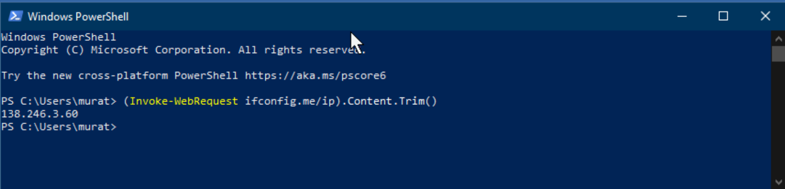
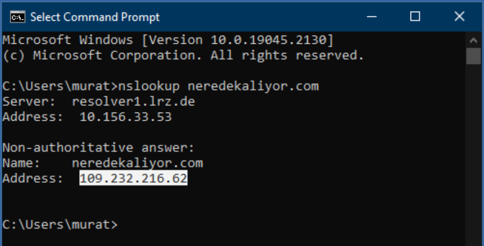
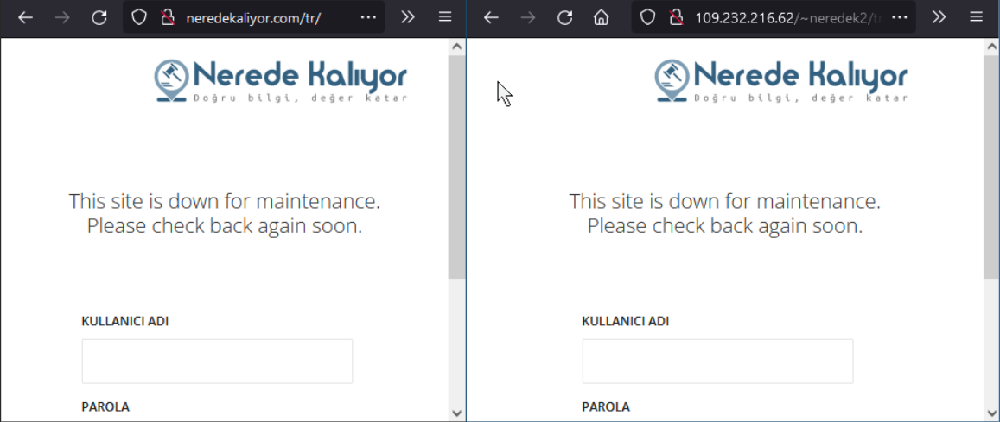

# Distributed Systems, Computer Networks & Internet


<blockquote>
Munich Technical University || Chair of Geoinformatics </br></br>
Murat Kendir, Prof. Thomas Kolbe || murat.kendir@tum.de
</blockquote>

## 1) Thin-Client & Fat-Client Architectures in the Web Applications

n this step,  we will learn how to observe some interactions on different web sites using “web developer tools” (in Firefox) or “Developer Tools” (Chrome). We will discuss which interactions are based on a Fat-Client or Thin-Client architecture in relation to our observations (Relevant Presentation: 01 - System Architectures / page 17).

### 1.a) Preparation for the Next Discussion about Tiers (Web Developer Tool / Developer Tool)

 - Open Firefox or Google Chrome web browser.
 - Simply navigate to the relevant page shown in the next topic ( [IRIS Seismic Monitor](https://ds.iris.edu/seismon/index.phtml) ) or go to a random web site.
 - Press Ctrl + Shift + C buttons together or Ctrl + Shift + I / Alternatively, you can navigate from menu:
 - For Firefox: Menu > More Tools > Web Developer Tool
 - For Chrome: Menu > More Tools > Developer Tool
 - Navigate to the Network tab and press reload button. / Alternatively, you can press F5 key for refreshing the page. (If you want to refresh the web page by clearing the cache, press Ctrl + F5)
 - Enable “Disable Cache” by checking the box.
 - Observe at a quick glance which files have been successfully downloaded and which have not. Download status is exposed as “status codes” in the first column of the Network tab. If you want to learn more about status codes, visit the page: [HTTP Status Codes](https://developer.mozilla.org/en-US/docs/Web/HTTP/Status) or search for “HTTP status codes”
 - Right-click on the column headers in the Network Pane and enable the Start Time, End Time, Response Time and Duration columns. All these temporal attributes will be visualized in the Timeline (called Waterfall in the Chrome browser) section in the Network Pane. (The same attributes are available in the Waterfall column in the Chrome browser. If you cannot see the Waterfall column, right-click on one of the column headers and enable it).
 - It is now possible to see loaded resources in ascending or descending time order. This is very useful for detecting the latest loaded resources on a web page.
 - Simply click on a row to view methods for these resources (GET/POST or DELETE) and header attributes (such as MIME types, and charset).
 - You can use the “Raw” switch to see raw data in the Response tab.

On Chrome: Clear panel, filter requests by requested data type.


On Chrome: Read the request header and the corresponding response, check the detailed data type (MIME type and character encoding / charset).


On Chrome: You can sort requests by clicking on the column names and it is also possible to sort by start time, end time, response time, etc. These are not displayed directly as separate columns, but you can find them in the “Timeline”/“Waterfall”.


On Firefox: Clear panel, filter requests by type of requested data


On Firefox: By clicking on a row, you can also view the details of a request and corresponding response. Also it’s possible to sort requests by start time, end time, etc. in Firefox.


### 1.b) Discussion about the Tiers in Layered Architectures

Examine the following web sites by using the “Web Developer Tools” / “Developer Tools” as described above and try to answer questions:
- [ ] A) What kind of tiers might the web applications have? (Application-Interface, Application, Data)
- [ ] B) Are the parts/files represented on the web app downloaded automatically or is the download triggered by an interaction?
- [ ] C) Is the web site in Thin-Client Architecture or Fat-Client Architecture?


#### 1.b.i) Seismic Monitor (IRIS)

[https://ds.iris.edu/seismon/index.phtml](https://ds.iris.edu/seismon/index.phtml)

- 1) Do the HTML, CSS and image files represent the application interface?


- 2)  After clicking on a point on the map, the World Seismic Map changed. Thus, the click event triggered the app to download another data from the server.


This website is a very old but working example of a web mapping application. It is a good example of a "thin client" architecture as data is always downloaded from the server by requests.


#### 1.b.ii) Geoportal Bayern

[https://geoportal.bayern.de/bayernatlas](https://geoportal.bayern.de/bayernatlas)

In the bottom right corner, select the base map to be loaded on the screen.


To load bike paths (Radwege), a cycling map, activate the Hiking and cycling trails layers (Freizeit in Bayern > Wander- und Radwege > Radwege). Once activated, you will see a green network on the map.


This individual biking trail net is retrieved from the server and is displayed as a transparent image. Let’s assume you need this image for another purpose, while you don’t see any button that allows you to directly download it. In this case, Web Developer Tool might be helpful.
Open Web Developer Tool, refresh the page, you will see a list of requests with image data. In order not to spend time on previewing each image, you can filter requests by “Name”. In our case, we search for “radwege” data, therefore we type “radwege” in Filter textbox.


Double-click on the relevant row and you will see a png file on a separate web page and you can easily save this bike path image.


#### 1.b.iii) TURF JS (Advanced geospatial analysis for browsers)

[https://turfjs.org/](https://turfjs.org/)

TurfJS is a JavaScript library that supports dealing with geospatial datasets in browsers and manipulating them using some spatial functions. It usually loads JS packages into the browser in compressed or linearized format like the other JS libraries.

> Tip: You can use [prettier.io](https://prettier.io/) web application to see these files in a “pretty printed” format.


Clear the available requests in the network pane and try to select an operation on the main web page (For example select “Voronoi”).


Try to zoom in and zoom out on one of the map (input or output widget).


## 2) Creating a Sequence Diagram using a Sample Request – Response Example

In this step, you will observe an interaction that takes place in the BayernAtlas web app. This interaction is a simple routing / navigation application that provides a route for specified leisure activity.
You will then create a sequence diagram taking into account this interaction and possible web services working in the background.

> Note: Do not consider timings (start time, duration etc.) of the requests.


### 2.a) Review the requests and responses before and after creating a route for mountain bikes (freizeitwege) in the BayernAtlas web app

Choose a routing mode. Such as “hiking” (wandern)  as shown in the first icon. Select the start point and end point on the map, a route will be created and a profile showing the elevation along the route.


The “route” and “profile” are created using data from the server. We can also download them as JSON files from the Web Developer Tool.


Clear the network pane before routing interaction and then observe the requests and responses triggered by this interaction.


Check the “method” of the “profile” request and check both of the request and response tabs in the detailed information pane for this service. 


Just as we did before, open Web Developer Tool, refresh webpage, and filter requests by “route” and “profile” respectively. 
By clicking the “route” cell, you can view formatted response JSON. 
Look into them respectively, figure out what information is stored in them.


If you are familiar with creating files with file extensions as well as changing file extensions in Windows system, you can skip the following file saving experiment.
Let’s assume we need these JSON data for another purposes. But unlike image files, which can be directly saved, this JSON data cannot be directly saved by right clicking on the panel. Therefore, we need to create a file with extension on local, copy the whole JSON data and paste it into the file you created. Make sure that the file you created has an extension “.json”, if you don’t see file extensions, check “File name extensions” in File Explore.


In the end, you will get a “route.json” file and a “profile.json” file.

### 2.b) Creating a Sequence Diagram to Describe the Process Happened in the Previous Step (2.a)

You can create UML diagram on [Diagrams Net](https://app.diagrams.net/)

Choose the location where you want to save your diagram. We suggest saving it in your local device, thus you don’t need to log in or register an account.
You can start drawing by creating a blank diagram.


As you start drawing, a panel will appear on the left side, where you can select UML shapes. Find those relevant shapes and use them to create your sequence diagram. You can refer to the lecture slides and see which shapes are relevant.


> Tip: In the application you can use the shapes named “Actor”, “Lifeline”, “Activation Bar”, “Self Call”, “Message” and “Return”. If you have forgotten the notations of the UML sequence diagram, check the slides 31-39  of the presentation “01 – System architectures”. 

If you find it difficult to draw the diagram, this tutorial can help you: [Visiual Paradigm - UML Tutorial](https://guides.visual-paradigm.com/creating-sequence-diagrams-in-uml-a-comprehensive-tutorial/)

## 3) Examining the Network & Internet Infrastructure

In this step, we will learn how to diagnose some network connections using Command Prompt (Eingabeaufforderung), Powershell or some web tools.

### 3.a) What is the current local IPv4 address for your machine? [ipconfig (Windows) / ifconfig (Linux) / ip address show (Linux) command]


### 3.b) What is the current IPv6 address?


### 3.c) What is the current external IPV4 address of your local network/router?



or visit the web page: [whatismyipaddress.com](https://www.whatismyipaddress.com)


### 3.d) What is the current IP-based geolocation?


### 3.e) What is the IP address of a selected website? (command: nslookup)



### 3.f) What is happening after “Reverse Lookup” for the previous ip address? (nslookup -X)

What is the TLD (Top Level Domain) authority for this IP address?


### 3.g) Internal structure of a web server and it's relation with the ip address

If you know the internal structure of a web server (web server configuration),you can still reach the web site using that IP address and the path you know.

To experiment with this, try querying ( [neredekaliyor.com](https://neredekaliyor.com), [109.232.216.62](https://109.232.216.62)) using nslookup and visit the page [109.232.216.62/~neredek2](https://109.232.216.62/\~neredek2) with your browser (Ip address might be changed, check it first with nslookup command).



### 3.h) Routing Domain or Subdomain (DNS)

Visit the page [mxtoolbox.com](https://mxtoolbox.com) or [dnstools.ch](https://dnstools.ch) website to query DNS
records for the selected domains.


### 3.i) Checking DNS records with nslookup command

Type “nslookup –type=MX” (or –type=A/CNAME/SOA/NS/TXT) for the selected domain to see results at the command prompt and compare results from network tool web applications.


### 3.j) Using ping command for web sites from different regions

Type “ping -n amazon.DOMAIN_SUFFIX” for different countries that may be near or far from the current country. (For Exp. COM / DE / AU / NZ / CN )


### 3.k) Use ping command for toher web sites

Repeat the same tasks with different domain suffixes on the network-tool or dnstools web site.


### 3.l) Using traceroute command

Select the domain with the most delayed ping response and use “traceroute” command in web apps to query it. Check the records of the sites with the least and most delay.


## 4) Python Request Script for a Known Public Web Service

Sample python code to run and request a source from internet with a specified URL.


### 4.a) Method 1 (Request Library):


```python
import requests
# Detailed Information about Requests here: https://pypi.org/project/requests
 
def get_one_file(custom_url, custom_file_name):
    """This function requests a single source from a public service over internet."""
    req = requests.get(custom_url)
    with open(custom_file_name, "wb") as my_file:
        my_file.write(req.content)
 
#Specify yhe URL here:
my_service_url = "https://geoservices.bayern.de/wms/v1/ogc_freizeitwege_oa.cgi?SERVICE=WMS&VERSION=1.1.1&REQUEST=GetMap&FORMAT=image%2Fpng&TRANSPARENT=true&LAYERS=by_fzw_radwege&LANG=de&SRS=EPSG%3A31468&STYLES=&WIDTH=2000&HEIGHT=819&BBOX=4464822%2C5336201%2C4468822%2C5337839"
#Specify the File Name here:
my_file_name = "myfile"
file_extension= ".png"
relative_path_of_file = "responses/exr1/" + my_file_name + file_extension

#Function executed here
get_one_file(my_service_url, relative_path_of_file)
print("Request has been made, check this path: ", relative_path_of_file)
```

    Request has been made, check this path:  responses/exr1/myfile.png


### 4.b) Method 2 (Using CURL) :


```python
import os
# Detailed information about OS library is here: https://docs.python.org/3/library/os.html

def get_one_file(custom_url, custom_file_name):
    """This function requests a single source from a public service over internet."""
    command='curl -X GET "' + custom_url + '" >' + custom_file_name
    os.system(command)
 
#Specify yhe URL here: 
my_service_url = "https://geoservices.bayern.de/wms/v1/ogc_freizeitwege_oa.cgi?SERVICE=WMS&VERSION=1.1.1&REQUEST=GetMap&FORMAT=image%2Fpng&TRANSPARENT=true&LAYERS=by_fzw_radwege&LANG=de&SRS=EPSG%3A31468&STYLES=&WIDTH=2000&HEIGHT=819&BBOX=4464822%2C5336201%2C4468822%2C5337839"
#Specify the File Name here: 
my_file_name = "myfile2"
file_extension= ".png"
relative_path_of_file = "responses/exr1/" + my_file_name + file_extension
 
get_one_file(my_service_url, relative_path_of_file)
print(f"Request has been made, check this path : {relative_path_of_file}")
```

    Request has been made, check this path : responses/exr1/myfile2.png


      % Total    % Received % Xferd  Average Speed   Time    Time     Time  Current
                                     Dload  Upload   Total   Spent    Left  Speed
    100   196  100   196    0     0   2989      0 --:--:-- --:--:-- --:--:--  3015

