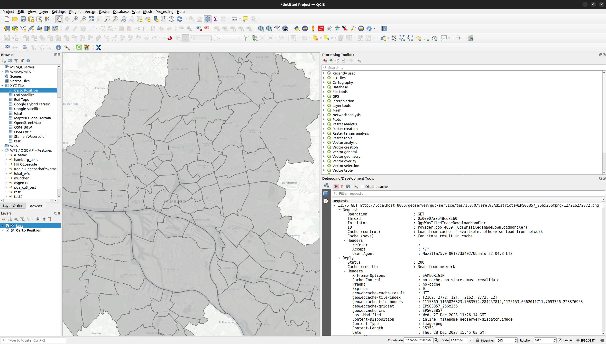

# Exercise 5 - Virtualization and Containers, Cloud Computing


<blockquote>
Munich Technical University || Chair of Geoinformatics </br></br>
Murat Kendir, Prof. Thomas Kolbe || murat.kendir@tum.de
</blockquote>

## Aim of Exercise
This exercise mainly focuses on Cloud Computing technologies and integrating cloud systems with GIS applications. You will practice with these systems to become more familiar with them by:
- Using virtualization to create a mini-infrastructure and run a GIS application
- Creating and serving a Tiled Map Layer and interconnecting the service with application interfaces/clients
- Setting up and publishing a dashboard interface representing a filtered dataset from a Sensorthings API service

>Check the "**exercise5_preparation**" document (pdf / ipynb) to review some useful resources.

Our goal is to provide a web interface to show a map containing sensors' online location data, use a custom tiled layer as a base map, and provide some graphical visualizations based on these sensors using virtualization technologies.
The steps required to achieve this goal will be as follows:
- Setting up a docker container to run and serve **Geoserver** as a base map provider.
- Setting up a docker container to run and serve **Grafana Dashboard** as the interface of our application.
- Connecting the Grafana Dashboard to an online data source (based on **Sensorthings API**), which provides some sensors available in Hamburg city
- Setting up the Grafana Dashboard interface to publish the **Tiled Map Layer** as the base map and the sensors as points

<div class="pagebreak" style="page-break-after:always;"> </div>

## 1 - Practice on Play-With-Docker web application

In this section, you will create a web application on the play-with-docker website by avoiding diving into computational needs. This page lets you play with docker containers and images in a limited time (4 hours). So, you can test different docker images or container settings if they integrate seamlessly. In this section, you don't need to provide a predefined dataset to the applications running in docker as a container. Try to only practice with docker commands and settings.

### 1.1 Docker Usage (on Playground)

Open the following website:
[play-with-docker](https://labs.play-with-docker.com)
- [ ] Click to <mark>login</mark> and select <mark>docker</mark>
  - [ ] Register with your email account first if you do not have a docker hub account.
    - [ ] If the popup is blocked, disable the popup blocker and try again.
- [ ] Docker Playground will be launched and a session will be started which will be live for 4 hours.
- [ ] Click to <mark>Add New Instance</mark>
- [ ] An instance runtime will be started with a specific local ip address and ssh key.
- [ ] List the running docker containers by typing <mark>docker ps</mark> in the terminal screen (e.g. command prompt of the instance).
- [ ] If you want to check all (running and idle) available docker containers, type <mark>docker ps \-\- all</mark>
- [ ] Check all available commands: <mark>docker \-\- help</mark>
- [ ] If you want to check command-specific options and arguments, type <mark>docker any_command \-\- help</mark> (For exp. "docker ps --help")

> TIP: The terminal screen and available commands here will have the same or similar commands as a Linux terminal screen (command line), because usually the examples run on a Linux system. To check which version of Linux is used as the base operating system, type <mark>uname -a</mark> in the terminal.


### 1.2 Running the first Docker container in instance

- [ ] There is no working docker containers yet.
- [ ] Start a new docker container by typing:
    ```bash
    docker run -d -p 3000:3000 \
    --name=grafana \
    -e "GF_INSTALL_PLUGINS=iosb-sensorthings-datasource" \
    grafana/grafana:latest
    ```
  - Explanations of options and arguments:
    -  <mark>\-d or \-\-detach</mark> : The container continues to run in the background.
    - <mark>\-p or \-\-publish</mark> : Forward (Publish) a port in the container to the host (Left side shows the port of the host machine and right side of the column shows the port of the container)
    - <mark>\-e or \-\-env</mark> : Sets environment variables
    - <mark>\-\-name (no alias)</mark>: Assign a name to the container, to easily recognize containers.
    - <mark>grafana\/grafana:latest</mark> means "publisher\/image:anyTag" : The last argument is the full name of the docker image. Usually, tags include version numbers.
- [ ] Check the available docker containers by typing <mark>docker ps</mark>

### 1.3 What actually happens after executing the "docker run" command?

- The Docker app checked if the requested image (grafana/grafana:latest) already exists in our host machine. 
- If it is not available, it tries to download it from **Docker Hub** by searching for the same image name.

- [ ] Visit the Docker Hub page and search for our image manually:
  - https://hub.docker.com
- You can optionally search for any docker image on the command line:
  - <mark>docker search grafana</mark>
- Check the available docker images in the host machine:
  - <mark>docker image ls</mark>


### 1.4 How to remove/delete docker images from the instance? (Optional)

- [ ] Try deleting the image:
  - <mark>docker rmi grafana/grafana:latest</mark>
- [ ] When an image is referenced to a container, the terminal will show an error and the container may still be running. So what we need to do is first stop the running container and then remove the referenced container:
  - <mark>docker stop \<CONTAINER_NAME\></mark>
  - or alternatively use the container ID shown in
    - Type <mark>docker container list</mark> (same as "ps" command) to see container IDs and names.
    - <mark>docker stop \<CONTAINER_ID\></mark>
- [ ] Check existing containers with the -all option:
  - <mark>docker ps \-\-all</mark>
- [ ] Remove the container:
- <mark>docker rm grafana</mark>
  - or alternatively with Container ID:
    - <mark>docker rm 829224beac3f</mark> (container IDs are not fixed numbers, try find your container's ID and replace with given one)
- [ ] Finally, remove the image from your instance:
  - <mark>docker rmi grafana\/grafana:latest</mark>

### 1.5 Docker Cheatsheet and the Relevance between linux commands

Many command abbreviations are inherited from Linux/Unix-based systems. These long command names can be used, for example, to make it easier to memorize abbreviated commands:
- cp : Copy
- rm : Remove
- exec : Execute
- cd : Change Directory
- ls : List
- ps : Processes
- diff : Difference

> TIP: However, one of the best ways to learn these commands is not to memorize them but to use a "Cheatsheet" document as an aid during the exercises. If you want to use such a document, visit this page: [Docker CLI Cheat Sheet](https://docs.docker.com/get-started/docker_cheatsheet.pdf)

### 1.6 Access to the Grafana Dashboard

- [ ] If you have already removed the container and image while following the instructions in section 1.4, start from scratch and start the docker container with the same command given earlier:
  - <mark>docker run -d -p 3000:3000 --name=grafana \-e "GF_INSTALL_PLUGINS=iosb-sensorthings-datasource" grafana/grafana:latest</mark>
- [ ] Now click the **Open Port** button at the top of the page and specify port **3000**. If your forwarded/published port is different, check the actual port number by typing <mark>docker ps</mark>.
- [ ] Type "admin" as username and password.
- [ ] Grafana will ask for a new password on the next page, type any password.
- If everything is OK, the Grafana start page will be shown.


### 1.7 Find and check the online datasource

- Now you need to select a **FROST Server** stream as the data source (remember that we started the Grafana container with the corresponding plugin)
- [ ] Visit page: [iot.hamburg.de](https://iot.hamburg.de/)
- [ ] Click for **SensorThingsApi v1.1**
> TIP: You can check the same data source with the **Online API Testing Tool** [reqbin.com](https://reqbin.com/) or other alternative online testing tools. (Try requesting for this URL: iot.hamburg.de/v1.1 )

### 1.8 Connect to a specific dataset from SensorThings API

- [ ] Return to the Grafana page running on localhost, expand the left side menu and go to **Connections**.
- [ ] Search for **"FROST SensorThings API Plugin"** and click on the listed plugin name. Click to **"Add new datasource"** button.
- [ ] Copy and paste the following address as URL value: <mark>https://iot.hamburg.de/v1.1</mark>
- [ ] Click to **Save and test**
- [ ] If you see <mark>Success</mark> message, expand the left menu pane again and go to **Dashboards**.
- [ ] Click **Create Dashboard**
- [ ] Click to **Add Visualization**
  - Note that your default data source is automatically selected as Frost SensorThings API.
- [ ] Select **"iosb-sensorthings-datasource"** as data source, if it is not selected automatically.
- [ ] Select Entry Point at the bottom of the page as **Things**.
- [ ] Type **"Verkehrszählstelle"** (Vehicle Counting Unit) just below the column **name** and find any sernsor datastream.
- [ ] Select the data source with the name "Kfz-Aufkommen an Verkehrszählstelle ... im 15-Min-Intervall" (The number of motor vehicles computed with the infrared camera at 15 minutes intervals) or another dataream with different time interval.
- [ ] If you see "No Data" on the graph widget, select another datastream.
- [ ] If you see "Data is missing a time field", go to the **Advanced** tab, and set the phenomenonTime Field type as "Time". Then you can select a time interval from the top-right edge of the graph widget.
- [ ] When you click to the **"Open Visiualization Suggestions"**, you will see a list of compatible graph types with your selected data.
- [ ] Select "**Bar Chart**".
- Click to **Apply** at top right corner of the page.


### 1.9 Customize the graph panel in Grafana

- The chart's axes will be set automatically since the data stream provides the "time" and "results" columns.
- If you want to customize your chart panel, check the right pane. (or click on the small arrow near the chart name at top right side of the page to expand the menu)
- Here you can change the chart's orientation, set the text sizes, show or hide the legend, show the result number on the chart, etc.
- A time interval selection button allows you to decrease or increase the time interval shown on the chart (in the upper right corner of the chart).
- Another functional panel can be the "Transform Data" tab, which can transform existing data by applying some functions or queries.


## 2. Build the app on local computer with Docker Desktop and CLI commands

In this section you will try to prepare all the requirements of the web application described in the "Aim of the Exercise" section. This workflow includes installing Docker Desktop, using CLI commands, running a geoserver container, publishing a wms service, and integrating the WMS service with Grafana Dashboard.

### 2.1 Docker Desktop Installation on Windows systems (optional)


Check this step if you want to download and install the Docker Desktop or CLI tool on your personal computer

- If this is your first time downloading and installing Docker Desktop, it may be more effective to enable the **WSL2* option in Docker Settings.
- Search for "**Windows Properties**" and try to enable "**Windows Subsystem**". It is mandatory to enable **Hyper-V**. Hyper-V is a virtualization support that might be provided by your computer's CPU hardware. If it is not possible to enable it, you should check the BIOS configuration and look for a virtualization support option (it is usually on the "Advanced" page or tab).
- Enable Windows Subsystem 
- Click on the gear icon in the top right corner and go to **Resources > WSL Integration**.
- At the first start of the Docker Desktop app, log in to Docker Hub using the Login button in the top right corner.
- You will continue using the CLI (Command Line Interface) tool, but you can still check the Desktop App to view the containers, images etc.


### 2.2 Serving a WMTS/TMS service from Geoserver as a Docker container

To offer a Tiled Map Layer, we need to run a server that will render the given geographic data source in raster file format, taking into account defined coordinate reference systems. We have multiple software options to do this. MapServer, GeoServer, ArcGIS Server or QGIS Server are the most popular ones. You will create a server instance using a docker image containing Geoserver to publish a WMTS/TMS.

> TIP: If you want to learn more about the WMTS and TMS visit the follwoing page:
> [What are the differences between TMS, XYZ & WMTS](https://gis.stackexchange.com/questions/132242/what-are-the-differences-between-tms-xyz-wmts)
> [Tile Map Specification](https://wiki.osgeo.org/wiki/Tile_Map_Service_Specification)

- Check the Geopackage representing the "StadtTeile" (City Districts) of the city center of Hamburg. (This data was downloaded from https://geoportal-hamburg.de/sga/ and reprojected to EPSG:3857 / Pseudo Mercator. File is stored in **shared_w_geoserver/data_dir/datasets** directory.)
- Extract or save directly to a subfolder under Documents. (Use always ASCII characters and underscore in the folder names, such as "hamburg_wmts". Do not use non-ASCII or special characters such as ä, ß, ü, < > (space) etc.)
  - If neccessary, create two nested subfolders in this folder, name it "**data_dir**" and "**datasets**"and move the geopackage file into the "datasets" folder.
- Copy the full path of the previously created folder and replace the relevant part of the following command:
```bash
docker run --detach --publish 8085:8080 ^
--name geoserver ^
--volume "<FULL_PATH_HERE>":/var/geoserver/datadir ^ 
geosolutionsit/geoserver
```
- Search for "Eingabeaufforderung" (Command Prompt) in the Windows Search bar and run it.
> WARNING: If you can't execute the "docker" command in the command line interface that means the system environmental variable has not been set for your system. However, you can still run the command by finding the docker cli executable. For a windows machine, it is stored in "C:\Program Files\Docker\Docker\resources\bin" with the name "com.docker.cli.exe". You can navigate into this folder by typing "**cd C:\Program Files\Docker\Docker\resources\bin**" then execute the program simply by replacing the word "docker" in the commands with "**com.docker.cli.exe**". For Example: "com.docker.cli.exe run --detach --publish 8085:8080 --name geoserver  --volume "C:\Users\murat\Documents\geoserver_data\datadir":/var/geoserver/datadir geosolutionsit/geoserver"

> TIP: The character ^ (Caret) is used only to create multi-line command. It works like an escape character and escapes from the next (invisible) newline character. This way, we can write multi-line commands in the windows command line.

For Example: 
```bash
docker run --name geoserver --interactive --tty ^
--publish 8085:8080 ^
--volume "./shared_w_geoserver/data_dir/datasets":"/opt/geoserver/data_dir/datasets" ^
-e GEOSERVER_ADMIN_USER=murat ^
-e GEOSERVER_ADMIN_PASSWORD=password ^
kartoza/geoserver
```
> TIP: Please note that the directions of the slash (/ or \\) characters are different in the -v (--volume) option values. This is because Windows and Linux systems use different types of slashes as directory separators (Windows: Backslash "\\", Linux/Unix: Forward Slash "/" )

- Check the Docker containers again:
  - <mark>docker ps</mark>
- Open your web browser and go to [http://localhost:8085/geoserver](http://localhost:8085/geoserver)
- To log in, enter "admin" as username and "geoserver" as password.
- Change the language by using dropdown menu at top right side of the page.
- Since Geoserver is being started for the first time, you must to add a new workspace. Click **Data > Workspaces** in the left pane. Click "**Add New Workspace**" and enter a descriptive name for your workspace and define a namespace URI. Use only ASCII characters in the namespace URI and not use special characters except underscore (_).
- Click to **save**.
- Click on the name of the workspace which you have created and enable **WMS and WMTS** options. Then click to Save again.
- Click **Data > Stores** in the left pane and click "**Add new store**" at the top of the page.
- Select one of the options under "**Vector Data Sources**": Geopackage.
- Check if the workspace is automatically selected. 
- Specify a name for the datastore and select a data source using the **Browse** button below **Connection Parameters > database**.
- Click to **save**.
- Go to **Gridsets** in the left menu (under the **Tile Caching** section). Click to **Create a new gridset** and specify the coordinate reference system as EPSG:3857. You can try using **Find** button on the right side or simply type the exact name of the CRS. Click on the **Compute from maximum extent of CRS** link and manually add zoom levels from 0 to 24 by clicking on the **Add Zoom Level** link at the bottom of the page. Specify a name for the custom gridset and click to **Save**.
- Go to the **WMTS** in the left menu (under the **Services** section). Select your workspace and **enable WMTS** using checkbox. Click to **Save**.
  - If the workspace is not shown in the menu on WMTS page, go back to the workspace page, select the workspace you created and activate the WMTS option in workspace settings. Then try to activate WMTS service by repeating the previous step.
- This is the last step to publish a WMTS/TMS service. Click **Data > Layers** in the left pane.
- Click "**Add a new Layer**" and select your workspace:store package with the "**Add Layer**" drop-down menu item.
- Click the "**Publish**" link and set a URI-like name for your WMS service layer (you can use non-ASCII characters and signs in the Title and Summary text boxes).
- In the "**Bounding Boxes**" group, click both "**Compute from Data**" and "**Compute from native bounds**" links to automatically calculate the "**Local Bounding Box**" and "**Aspect Bounding Box**".
- Switch to the next tab called "**Publishing**" and select "**Polygon**" from the Available Styles. Click the right arrow icon to apply it to the WMS layer as a style.
- Check the "**Tile Caching**" tab to make sure about the tile. "**Create a cached layer for this layer**" and "**Enable tile caching for this layer**" should be enabled.
- At the bottom side of the Tile Caching tab, there will be the gridset options. Find the drop-down menu near the **Add grid subset** option and select the gridset noted before or the gridset you created.
- Click to **save**.


### 2.3 Test the Availability of WMTS/TMS services with QGIS

Since both service standards are commonly used tiled map services, multiple methods exist to test their availability.


#### 2.3.1 Method 1: Use the Geoserver Preview option

- Go to **Tile Layers** in the left menu of the Geoserver administrator page.
- If you see the layer published before, there will be a preview option to see WMTS integrated with OpenLayers. Click on the drop-down menu under the **Preview** column and select the gridset configured with the CRS EPSG:3857.
- Activate the **(Web) Developer Tool** by pressing Ctrl+Shift+C (or I) in the web browser.
- Go to the Network tab and press the **Reload** button if needed.
- Check the URL sources loaded from the Geoserver instance.
- Copy one of the URL requests and take as note in somewhere. You will use the requested URL in next section to view the same service on QGIS.

#### 2.3.2 Method 2: Use QGIS to test WMTS services

- To use QGIS as a WMTS client, you need to detect the baseurl of the WMTS service. Go to the Welcome page of the Geoserver administrator page by clicking on the logo at the top left corner of the page. Find the **WMTS** box and click on the version number available in the box (The current version number for the WMTS is **1.1.1**).
- This link will automatically forward the page to the GetCapabilities request. Copy the whole address except the part after the question mark (The following part specifies the parameters.).
  - In our example, the base URL was: **http://localhost:8085/geoserver/gwc/service/wmts?**
- Open QGIS software and navigate to **Layer \> Add Layer \> Add WMS/WMTS Layer** in the top menu.
- Click the **New** button and paste the base URL into the URL textbox. Specify a custom name and Click **Ok**.
- Click the **Connect** button and select the layer published with the gridset configured with EPSG:3857 CRS. Click the **Add** button.

#### 2.3.3 Method 3: Use QGIS to test TMS service



- Go to the Welcome page of the Geoserver by clicking on the logo at the top left corner of the page. Find the **TMS** box and click on the available version number in the same box (The current version number for the TMS is **1.0.0**).
- This link will forward the page to the default page of a TMS service, which shows all available gridsets and their links. Copy the link belonging to the correct gridset with the CRS EPSG:3857.
- Open a new project in QGIS and find the **XYZ Tiles** in the Browser pane (if it is not available, check the option in View \> Panel \> Browser). Right-click on the "XYZ Tiles" and select the option **New Connection**.
- Paste the URL copied before and add the following string at the end of your URL:
  - <mark>/{z}/{x}/{-y}.png</mark>
  - The full link might be like this: <mark>http://localhost:8085/geoserver/gwc/service/tms/1.0.0/yerel%3Adistricts@EPSG3857_256x256@png/{z}/{x}/{-y}.png</mark>
- Specify a custom name and click the **Ok** button.

> TIP: We used {-y} as the tile row number (north-south axis) as the last coordinate parameter. This has to be specified because we published a TMS layer but accessed it as an XYZ layer. TMS and XYZ standards are quite similar services except for the definition of the Y axis. In the TMS, the Y axis identifies the vertical tile number from bottom to top, while XYZ identifies the Y axis reversely.

> REMINDER: You can activate the "**Debugging/Developer Tool**" by navigating into View > Panels in the top menu. This tool is similar to the (Web) Developer Tool in the web browsers. Press the red circle button (Record icon) to see the requests in more detailed way.

### 2.4 Integrating Grafana Dashboard with the Tiled Map

Usually, map-based JavaScript libraries support overlaying the map with WMS or WMTS layers. However, the map viewer plugins available in Grafana have limited functionality. There are currently five map plugins (NativePlugin:GeoMap, WorldMap Panel, Orchestra Cities Map, Mapgl, TrackMap) with different features, none of which support adding WMS layers yet. The only possibility to add a base map to these map plugins is to publish a TMS service and connect it like an XYZ service (Check the previous section 2.3.3). 

#### 2.4.1 Start Grafana Dashboard and add the XYZ base map


- Start a new docker container by typing:
```bash
docker run --detach --publish 3000:3000 ^
--name=grafana ^
--env "GF_INSTALL_PLUGINS=iosb-sensorthings-datasource" ^
grafana/grafana:latest
```
- Visit the page [localhost:3000](http://localhost:3000). Enter "admin" as username and password.
- The next page in Grafana prompts for a new password, type any password.
- Go to **Connections** in the left menu (Click to three dash icon on the top left corner) and search for "FROST Sensorthings API Plugin" (iosb-sensorthings-datasource).
-  Click on the plugin and set the URL as "**https://iot.hamburg.de/v1.1**". Click to **Save & test** button to check if everything works well.
- Go to the **Dashboards** in the left menu and click on the **Add visualization** button.
- Select the **iosb-sensorthings-datasource** as data source.
- Change the visiualization type as **Geomap** (The native map library of Grafana Dashboard) from the top right corner.
- Go to the **Map View** tab in the right menu and change the **View** option as **Coordinates**
- Set Latitude, Longitude and Zoom level as following values: 53.56, 9.97, 10 (This configuration sets up the map view to cover Hamburg's city center.)
- Navigate to **Basemap layer** in the right menu.
  - Alternatively, you can add XYZ tile layer as **Map layer**. This option will overlay your XYZ layer over the default XYZ base map and will let to set up the transparency of your XYZ layer. If you want to apply this option, go to **Map Layers** and apply similar steps described below.
- Click to **Layer Type** and select the **XYZ Tile Layer** option. This selection will add the default XYZ tile layer which is an ArcGIS service publicly available.
- Copy and paste the XYZ service URL, which you already tested in the section 2.3.3


#### 2.4.2 Set up a data source to show on the map

- You specified the data source in the previous steps, but it has not been used yet. Now you can use it by specifying the attribution.
- Go to the **Query** pane at the left bottom and expand the first query "A" if it is collapsed.
- Click on the **Advanced** tab to specify the attributes and coordinates of a dataset.
- In the **Sensorthings API** URL, you need to specify the relative path of a specific dataset. Also note that the first part of the URL (base URL) was given during the setup of the data source (https://iot.hamburg.de/v1.1). For Example, The collection of the sensor with ID 5647 shows the infrared camera installations used to detect vehicles, including cars and bicycles. [https://iot.hamburg.de/v1.1/Sensors(5647)](https://iot.hamburg.de/v1.1/Sensors(5647)) If you check the Datastreams available within this collection, you will reach the datastream connections with given attributes and coordinates as a large array. You should specify a limit for the downloaded array elements to increase the network performance. To do this, you can specify a limit by typing <mark>\$top\=100</mark>. So the Sensorthings URL will be as <mark>/Sensors\(5647\)/Datastreams\?\$top\=100</mark> in our example.
- Check the dataset manually in your web browser and try to find some attributes available in the responses. For example, try to find the position of the **phenomenonTime** and the coordinates.
- Expand the tab called **Manually Assign Fields**.
- Go to the textboxes called **Field**, remove the default field "\$\.value\[\*\].result" may appear  and add the first attribute by typing <mark>\$.value\[\*\].phenomenonTime</mark>. This query notation represents the nested structure of the JSON file downloaded as a response from FROST server. **Current Document \(\$\)** > **Any element in Array \[\*\]** > **Attributes or Sub-Objects**
- Type "Time" for the phenomenonTime field as an alias and click on the plus (+) icon on the right side.
- Type <mark>\$\.value\[\*\]\.observedArea\.coordinates\[0\]</mark> to specify the longitude value available in the current dataset. Change the data type to **Number** and set the alias as "longitude" or "long". Also, note that the position of the coordinate values might differ if you used a different data source.
- Finally, type <mark>$.value\[*\].observedArea.coordinates\[1\]</mark> to specify the latitude. Change the data type to "**Number**" and set the alias as "latitude" or "lat". Unfortunately, there is no descriptive information in the JSON file to determine which element is longitude and which is latitude. You need to use your geographic knowledge about the focused area.
- Go to the **Map Layers** tab on the right pane. Let the layer type as default "Markers" and change the **Location Mode** to "Coords". Then select the longitude/latitude or long/lat fields per each drop-down box.
- Go to the top right corner of the map view and select the period as "**Last 2 Year**".


