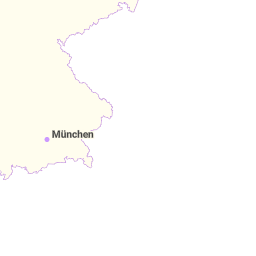
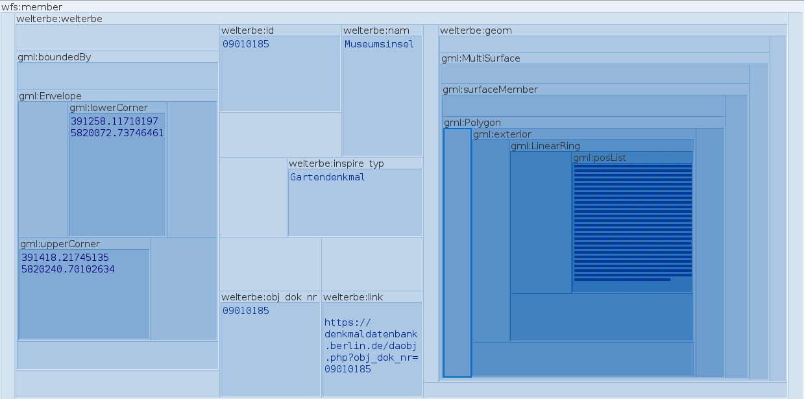

# Samples for Discussion


<blockquote>
Munich Technical University > Engineering & Design > Aerospace & Geodesy > Chair of Geoinformatics </br></br>
Murat Kendir, Prof. Thomas Kolbe || murat.kendir@tum.de
</blockquote>

## Sample Web Services

### CSW Servers (Catalog Service for the Web)

- **Metaver.de**
  - Repository : [metaver.de](https://metaver.de)
  - Main URL : [https://metaver.de/csw?](https://metaver.de/csw?)
  - GetCapabilities Request : [https://metaver.de/csw?SERVICE=CSW&version=2.0.2&request=GetCapabilities](https://metaver.de/csw?SERVICE=CSW&version=2.0.2&request=GetCapabilities)
- **Federal Institute for Geosciences and Natural Resources**
  - Repository : [geoportal.bgr.de](https://geoportal.bgr.de)
  - Main URL : [https://geoportal.bgr.de/smartfindersdi-csw/api?](https://geoportal.bgr.de/smartfindersdi-csw/api?)
  - GetCapabilities Request: [https://geoportal.bgr.de/smartfindersdi-csw/api?Request=GetCapabilities&Service=CSW&Version=2.0.2](https://geoportal.bgr.de/smartfindersdi-csw/api?Request=GetCapabilities&Service=CSW&Version=2.0.2)

### WMS Servers (Web Map Service)

- **German Aerospace Center**
  - Repository : [geoservice.dlr.de](https://geoservice.dlr.de)
  -   Main URL : [https://geoservice.dlr.de/eoc/elevation/wms?](https://geoservice.dlr.de/eoc/elevation/wms?)
  -   GetCapabilities Request : [https://geoservice.dlr.de/eoc/elevation/wms?SERVICE=WMS&VERSION=1.3.0&REQUEST=GetCapabilities](https://geoservice.dlr.de/eoc/elevation/wms?SERVICE=WMS&VERSION=1.3.0&REQUEST=GetCapabilities)
  -   GetMap Request Sample : [SRTM-X DEM Mosaic](https://geoservice.dlr.de/eoc/elevation/wms?SERVICE=WMS&VERSION=1.3.0&REQUEST=GetMap&BBOX=46.77082519987465048%2C9.050240780867593315%2C46.95085097403297425%2C9.234170366642356242&CRS=EPSG%3A4326&WIDTH=1225&HEIGHT=1200&LAYERS=srtm_x-sar_dem_mosaic&STYLES=&FORMAT=image%2Fpng&DPI=96&MAP_RESOLUTION=96&FORMAT_OPTIONS=dpi%3A96&TRANSPARENT=TRUE)


- **Hamburg Building Footprints (INSPIRE/ATKIS)**
  - Repository : [transparenz.hamburg.de](https://transparenz.hamburg.de/)
  - Main URL : [https://geodienste.hamburg.de/HH_WMS_INSPIRE_Gebaeude_2D_ATKIS_Basis_DLM?](https://geodienste.hamburg.de/HH_WMS_INSPIRE_Gebaeude_2D_ATKIS_Basis_DLM?)
  - GetCapabilities Request : [https://geodienste.hamburg.de/HH_WMS_INSPIRE_Gebaeude_2D_ATKIS_Basis_DLM?SERVICE=WMS&VERSION=1.3.0&REQUEST=GETCAPABILITIES](https://geodienste.hamburg.de/HH_WMS_INSPIRE_Gebaeude_2D_ATKIS_Basis_DLM?SERVICE=WMS&VERSION=1.3.0&REQUEST=GETCAPABILITIES)
  - GetMap Request Sample : [HH_WMS_Gebaeude_2D_ATKIS_Basis](https://geodienste.hamburg.de/HH_WMS_INSPIRE_Gebaeude_2D_ATKIS_Basis_DLM?SERVICE=WMS&VERSION=1.3.0&REQUEST=GetMap&BBOX=1111942.144059270155%2C7082582.984302694909%2C1115292.715944103431%2C7085541.258006609045&CRS=EPSG%3A3857&WIDTH=1358&HEIGHT=1200&LAYERS=BU.Building&STYLES=&FORMAT=image%2Fpng&DPI=96&MAP_RESOLUTION=96&FORMAT_OPTIONS=dpi%3A96&TRANSPARENT=TRUE)

### WMTS Servers (Web Map Tile Service)

- **BaseMap.de**
  - Repository: [basemap.de](https://basemap.de)
  - Capabilities URL: [https://sgx.geodatenzentrum.de/wmts_basemapde/1.0.0/WMTSCapabilities.xml](https://sgx.geodatenzentrum.de/wmts_basemapde/1.0.0/WMTSCapabilities.xml)
  - GetTile URL : [https://sgx.geodatenzentrum.de/wmts_basemapde/tile/1.0.0/de_basemapde_web_raster_farbe/default/DE_EPSG_25832_ADV/09/383/297.png](https://sgx.geodatenzentrum.de/wmts_basemapde/tile/1.0.0/de_basemapde_web_raster_farbe/default/DE_EPSG_25832_ADV/09/383/297.png)

- **TopPlusOpen**

  - Repository: [Bundesamt für Kartographie und Geodaesie](https://gdz.bkg.bund.de/)
  - Capabilities URL : [https://sgx.geodatenzentrum.de/wmts_topplus_open/1.0.0/WMTSCapabilities.xml](https://sgx.geodatenzentrum.de/wmts_topplus_open/1.0.0/WMTSCapabilities.xml)
  - GetTile URL (sample) : [https://sgx.geodatenzentrum.de/wmts_topplus_open/tile/1.0.0/web/default/WEBMERCATOR/10/343/549.png](https://sgx.geodatenzentrum.de/wmts_topplus_open/tile/1.0.0/web/default/WEBMERCATOR/10/343/549.png)

<blockquote style="background-color:ivory;">
    TIP: An important clue about WMTS servers is that they work in a similar way to XYZ tiles. The key difference between XYZ tiles and TMS-based (Tile Map Specification) WMTS services is the order of the axes of the desired tile: </br>
<ul>
    <li>XYZ tiles is calling tile with this order: {Zoom Level/Z} / {Row Number/Y} / {Column Number/X}</li>
    <li>WMTS service is calling tile with this order: {Zoom Level/Z} / {Column Number/X} / {Row Number/Y}</li>
</ul>
It is therefore theoretically possible to call a WMTS service as an XYZ tile layer. You can test the same service on QGIS by registering it as both WMTS and XYZ and changing the order of the {x} and {y} values.
</blockquote>


### WFS Services (Web Feature Service)

- **Hamburg - Minimum groundwater level 2019**
  - Repository : [transparenz.hamburg.de](https://transparenz.hamburg.de/)
  - Main URL : [https://geodienste.hamburg.de/HH_WFS_Grundwasserschutz?](https://geodienste.hamburg.de/HH_WFS_Grundwasserschutz?)
  - GetCapabilities Request : [https://geodienste.hamburg.de/HH_WFS_Grundwasserschutz?REQUEST=GetCapabilities&SERVICE=WFS](https://geodienste.hamburg.de/HH_WFS_Grundwasserschutz?REQUEST=GetCapabilities&SERVICE=WFS)
  - GetFeature Request Sample (Max 3) : [HH_WFS_Grundwasserschutz](https://geodienste.hamburg.de/HH_WFS_Grundwasserschutz?SERVICE=WFS&REQUEST=GetFeature&VERSION=2.0.0&TYPENAMES=de.hh.up:u12_f_gw_flurabstand_min&SRSNAME=EPSG:25832&COUNT=3)

- **World Heritage Sites in Berlin**
  - Repository : [daten.berlin.de](https://daten.berlin.de)
  - Main URL : [https://gdi.berlin.de/services/wfs/welterbe?](https://gdi.berlin.de/services/wfs/welterbe?)
  - GetCapabilities Request : [https://gdi.berlin.de/services/wfs/welterbe?REQUEST=GetCapabilities&SERVICE=wfs](https://gdi.berlin.de/services/wfs/welterbe?REQUEST=GetCapabilities&SERVICE=wfs)
  - GetFeature Request Sample (Max 3) : [Welterbestätten / Heritage Sites](https://gdi.berlin.de/services/wfs/welterbe?SERVICE=WFS&REQUEST=GetFeature&VERSION=2.0.0&TYPENAMES=welterbe:welterbe&STARTINDEX=0&COUNT=3&SRSNAME=urn:ogc:def:crs:EPSG::25833)

### OGC API - Features services

- **Verkehrsstärken Hamburg**
  - Repository : [transparenz.hamburg.de](https://transparenz.hamburg.de)
  - Main URL : [api.hamburg.de/datasets/v1/verkehrsstaerken](https://api.hamburg.de/datasets/v1/verkehrsstaerken)
  - API Conformance URL : [api.hamburg.de/datasets/v1/verkehrsstaerken/conformance?f=json](https://api.hamburg.de/datasets/v1/verkehrsstaerken/conformance?f=json)
  - Collections : [api.hamburg.de/datasets/v1/verkehrsstaerken/collections?f=json](https://api.hamburg.de/datasets/v1/verkehrsstaerken/collections?f=json)
  - Items : [https://api.hamburg.de/datasets/v1/verkehrsstaerken/collections/radverkehr_dtv_dtvw/items?&limit=10&offset=0&f=json](https://api.hamburg.de/datasets/v1/verkehrsstaerken/collections/radverkehr_dtv_dtvw/items?&limit=10&offset=0&f=json)

- **Niedersachsen ALKIS Data**
  - Repository : [ni-lgln-opengeodata.hub.arcgis.com/](https://ni-lgln-opengeodata.hub.arcgis.com/)
  - Main URL : [alkis.stac.lgln.niedersachsen.de/](https://alkis.stac.lgln.niedersachsen.de/)
  - API Conformance URL : [alkis.stac.lgln.niedersachsen.de/conformance](https://alkis.stac.lgln.niedersachsen.de/conformance)
  - Collections : [alkis.stac.lgln.niedersachsen.de/collections](https://alkis.stac.lgln.niedersachsen.de/collections)
  - Items : [alkis.stac.lgln.niedersachsen.de/collections/alkis-hausumringe/items?limit=10&bbox=-175.05,-85.05,175.05,85.05&datetime=2018-02-12T23:20:50Z](https://alkis.stac.lgln.niedersachsen.de/collections/alkis-hausumringe/items?limit=10&bbox=-175.05,-85.05,175.05,85.05&datetime=2018-02-12T23:20:50Z)

- **North Rhine-Westphalia, Cadastre**
  - Repository : [www.bezreg-koeln.nrw.de/](https://www.bezreg-koeln.nrw.de/)
  - Main URL : [ogc-api.nrw.de/lika/v1](https://ogc-api.nrw.de/lika/v1)
  - API Conformance URL : [https://ogc-api.nrw.de/lika/v1/conformance?f=json](https://ogc-api.nrw.de/lika/v1/conformance?f=json)
  - API Interface : [https://ogc-api.nrw.de/lika/v1/api](https://ogc-api.nrw.de/lika/v1/api)

### WCS Services (Web Coverage Service)

- **Copernicus Data Hub**
  - Repository : [documentation.dataspace.copernicus.eu](https://documentation.dataspace.copernicus.eu/APIs/SentinelHub/OGC/WCS.html)
  - Main URL : https://sh.dataspace.copernicus.eu/ogc/wcs/<INSTANCE_ID> (Instance_ID is the token given to the registered users)
  - Sample URL : https://sh.dataspace.copernicus.eu/ogc/wcs/81ee4fd4-3ef6-4a0e-b2fd-054e6780f32d?
  - Get Capabilities URL : [https://sh.dataspace.copernicus.eu/ogc/wcs/81ee4fd4-3ef6-4a0e-b2fd-054e6780f32d?REQUEST=GETCAPABILITIES&SERVICE=WCS](https://sh.dataspace.copernicus.eu/ogc/wcs/81ee4fd4-3ef6-4a0e-b2fd-054e6780f32d?REQUEST=GETCAPABILITIES&SERVICE=WCS)

- **USGS ScienceBase**
  - Repository : [https://www.sciencebase.gov/catalog/](https://www.sciencebase.gov/catalog/)
  - Get Capabilities URL : [https://sciencebase.usgs.gov/geoserver/ows?service=WCS&acceptversions=2.0.1&request=GetCapabilities](https://sciencebase.usgs.gov/geoserver/ows?service=WCS&acceptversions=2.0.1&request=GetCapabilities)

## Investigation of Web Services in Python

### Accessing to CSW services

Please check first the documentation page of [the OWSLib](https://owslib.readthedocs.io/en/latest/).


```python
# Get the CSW class from the OWSLib.
from owslib.csw import CatalogueServiceWeb
from owslib.fes import PropertyIsLike

#Specify the CSW Server
my_csw = CatalogueServiceWeb('https://geoportal.bgr.de/smartfindersdi-csw/api?')

#Check the available operations for the CSW service
for op in my_csw.operations:
    print(op.name)

# Prepare the query for listing relevant services or data sources
bremen_query = PropertyIsLike('csw:AnyText', '%Bremen%')

# Get results of the given query
my_csw.getrecords2(constraints=[bremen_query], maxrecords=10)
# Alternatively, you can use CQL (Common Query Language) expressions:
#my_csw.getrecords2(cql='csw:AnyText like "%Bremen%"')

# Learn how many records fits actually to our query:
print(my_csw.results)

# Check the available attributes and methods of any instance in the records object
# print(dir( next(iter(my_csw.records)) ) )

for x in my_csw.records:
  print(my_csw.records[x].identifier, ' : ', my_csw.records[x].title)

```

    GetCapabilities
    GetRecords
    GetRecordById
    DescribeRecord
    Harvest
    {'matches': 15, 'returned': 10, 'nextrecord': 11}
    4466C8F0-3CA5-4098-9869-DBA4269CF0C3  :  Bodenübersichtskarte 1:200.000 (BÜK200) - CC3110 Bremerhaven
    3EE608D6-D46F-4406-933F-2492C55308D3  :  Bodenübersichtskarte 1:200.000 (BÜK200) - CC3118 Hamburg-West
    AC3815DC-663E-4325-9283-CAC631989F15  :  Karte der oberflächennahen Rohstoffe der Bundesrepublik Deutschland 1:200.000 (KOR200) - CC 3118 Hamburg-West
    B36CD520-A63B-4DEF-8F83-79DE64E07236  :  Bodenübersichtskarte 1:200.000 (BÜK200) - CC2310 Helgoland
    8b70fe0f-0b03-477b-a3cd-c0f13a2c41b2  :  3D Modell des tieferen Untergrundes des Norddeutschen Beckens
    66CFEE61-8B60-4DA7-9632-56753CE0BFE8  :  Schutzpotenzial der Grundwasserüberdeckung
    a3f2f6a5-120c-4732-97a0-1db01f26557d  :  Processed seismic data of Cruise HE242
    d973f1af-db9f-4632-bd05-8964cc906b38  :  Processed seismic data of Cruise AL278 2006
    8BEBDE77-8C6A-48D5-BBAA-C7D7EF01D85D  :  Schutzpotenzial der Grundwasserüberdeckung (WMS)
    2bd333c5-ed2b-4bc2-9c43-eb735ba37f6c  :  Hubschrauber-Elektromagnetik (HEM) Gebiet 196 Gnarrenburg


### Accessing to WMS services


```python
from owslib.wms import WebMapService as wms

# Add a WebMapService object using its alias
my_wms = wms('https://geoservice.dlr.de/eoc/elevation/wms?')

# Inspect the service type, version and title
print(my_wms.identification.type)
print(my_wms.identification.version)
print(my_wms.identification.title, '\n')

# Check the available operations for the WMS service
ops_list = []
for op in my_wms.operations:
    ops_list.append(op.name)
print(ops_list, '\n')

# Check the layers available in the WMS service
print( list(my_wms.contents) )

# Check the supported image formats by the WMS service
# print(my_wms.getOperationByName('GetMap').formatOptions)
```

    OGC:WMS
    1.1.1
    EOC Elevation Map Service 
    
    ['GetCapabilities', 'GetMap', 'GetFeatureInfo', 'DescribeLayer', 'GetLegendGraphic', 'GetStyles'] 
    
    ['srtm_x-sar_mosaic', 'srtm_x-sar_hillshade_mosaic', 'srtm_x-sar_dem_mosaic', 'TDM90_AM2', 'TDM90_AMP', 'TDM90_COM', 'TDM90_COV', 'TDM90_DEM', 'TDM90_HEM', 'TDM90_LSM', 'TDM90_WAM', 'TDM_POLARDEM90_ANT_DEM', 'TDM_POLARDEM90_ANT_HSC', 'TDM_POLARDEM90_ANT_HSM', 'TDM_POLARDEM_ANT_COASTLINE', 'srtm_x-sar_hem_mosaic']


```python
import requests
from IPython.display import Image

# Decide to which extent must be rendered with which CRS. Use your GIS app if you need.

# SAMPLE GETMAP REQUEST WAS:
sample_request = """https://geoservice.dlr.de/eoc/elevation/wms?\
SERVICE=WMS\
&VERSION=1.3.0\
&REQUEST=GetMap\
&BBOX=47,9.05,47.2,9.25\
&CRS=EPSG:4326\
&WIDTH=1200\
&HEIGHT=1200\
&LAYERS=srtm_x-sar_dem_mosaic\
&STYLES=\
&FORMAT=image/png\
&DPI=96\
&MAP_RESOLUTION=96\
&FORMAT_OPTIONS=dpi:96\
&TRANSPARENT=TRUE"""

# So, you can test it with requests library too:
test_wms = requests.get(sample_request)

# Check the available methods and attributes for the requests object:
# print(dir(test_wms))

# Render the response
# Image(test_wms.content)

# If your test goes well with the sample URL, you can specify your own request
img = my_wms.getmap(
    layers=['srtm_x-sar_mosaic'],
    size=[300, 300],
    srs="EPSG:4326",
    bbox=[47,9.05,47.2,9.25],
    format="image/png")

Image(img.read())


```


    

    


### Accessing to WMTS services


```python
from owslib.wmts import WebMapTileService as wmts

my_wmts = wmts('https://sgx.geodatenzentrum.de/wmts_basemapde')

print(my_wmts.identification.type)
print(my_wmts.identification.version)
print(my_wmts.identification.title, '\n')

# Check the available layers for the WMTS service
print( list(my_wmts.contents), '\n' )

# Check the available TileMatrixSets in the WMTS service
print(my_wmts.tilematrixsets, '\n')

# Store the Capabilities document on to your computer
with open("responses/samples_for_discussion/my_wmts_servicexml.xml", "wb") as wmts_xml:
        wmts_xml.write(my_wmts.getServiceXML())
        print ('File (' + wmts_xml.name + ') has been saved.')
```

    OGC WMTS
    1.0.0
    WMTS DE BASEMAP.DE WEB RASTER 
    
    ['de_basemapde_web_raster_farbe', 'de_basemapde_web_raster_grau'] 
    
    {'DE_EPSG_25832_ADV': <owslib.wmts.TileMatrixSet object at 0x7e95475eb4a0>, 'DE_EPSG_3857_ADV': <owslib.wmts.TileMatrixSet object at 0x7e95475e80e0>, 'DE_EPSG_25833_ADV': <owslib.wmts.TileMatrixSet object at 0x7e95475e9c10>, 'GLOBAL_WEBMERCATOR': <owslib.wmts.TileMatrixSet object at 0x7e95475ead20>} 
    
    File (responses/samples_for_discussion/my_wmts_servicexml.xml) has been saved.


```python
img = my_wmts.gettile(
    layer='de_basemapde_web_raster_farbe',
    tilematrixset="DE_EPSG_25832_ADV",
    tilematrix='01',
    row=1,
    column=1,
    format="image/png")

Image(img.read())
```


    

    


### Accessing to WFS


```python
from owslib.wfs import WebFeatureService as wfs

my_wfs = wfs('https://gdi.berlin.de/services/wfs/welterbe?')

# Inspect the service type, version and title
print(my_wfs.identification.type)
print(my_wfs.identification.version)
print(my_wfs.identification.title, '\n')

# List available operations with a Python comprehension (shorten function)
op_list = [op.name for op in my_wfs.operations]
print( op_list , '\n')

# Check the available contents for the WFS service
print( list(my_wfs.contents), '\n' )

# Get help document for a selected operation
#help(my_wfs.getfeature)

# Sample GetFeature Request URL:
# https://gdi.berlin.de/services/wfs/welterbe?
#SERVICE=WFS&REQUEST=GetFeature&VERSION=2.0.0&
#TYPENAMES=welterbe:welterbe&STARTINDEX=0&COUNT=3&SRSNAME=urn:ogc:def:crs:EPSG::25833

my_objects = my_wfs.getfeature(
    typename = ['welterbe:welterbe'],
    srsname = 'urn:ogc:def:crs:EPSG::25833',
    maxfeatures = 3,
    startindex = 0
)

# Check the type of the request.
# print( type(my_objects) )

# Check the supported image formats by the WMS service
print(my_wfs.getOperationByName('GetFeature').formatOptions)

# Store the response file on to your computer
with open("responses/samples_for_discussion/my_wfs_response.gml", "wb") as wfs_gml:
        wfs_gml.write(my_objects.read())
        print ('File (' + wfs_gml.name + ') has been saved.')
```

    WFS
    1.0.0
    Welterbestätten Berlin 
    
    ['GetCapabilities', 'DescribeFeatureType', 'GetFeature'] 
    
    ['welterbe:welterbe'] 
    
    ['{http://www.opengis.net/wfs}GML2']
    File (responses/samples_for_discussion/my_wfs_response.gml) has been saved.


### Parsing XML/GML in Python

XML/GML files are often structured as complex data models. Storing responses is therefore not always sufficient to understand the data content. Despite this challenge, we have multiple options for understanding the structure of data models:
- Open downloaded data with an XML Software (see picture below)
- Download XML Schema (XSD files) using the DescribeFeatureType operation
- Reading the data source documentation that may be provided by the provider
- An additional solution can be parsing XML files in Python with help of **xmltodict library**.




```python
import xmltodict as xd
import pprint 

with open("responses/samples_for_discussion/my_wfs_response.gml", "r") as stored_wfs:
    wfs_text = stored_wfs.read()
    wfs_text_enc = wfs_text.encode('utf-8')
    my_dict = xd.parse(wfs_text_enc)

my_pp = pprint.PrettyPrinter(indent=4)
my_pp.pprint(my_dict['wfs:FeatureCollection']['gml:featureMember'][1]['welterbe:welterbe']['gml:boundedBy'])
```

    {   'gml:Box': {   '@srsName': 'http://www.opengis.net/gml/srs/epsg.xml#25833',
                       'gml:coordinates': {   '#text': '393520.19630308,5822766.23041044 '
                                                       '393944.72582015,5823161.95202459',
                                              '@cs': ',',
                                              '@decimal': '.',
                                              '@ts': ' '}}}


### Accessing to OGC API - Features


```python
from owslib.ogcapi.features import Features as ftr
import pprint

my_pp = pprint.PrettyPrinter(indent=2)

my_api = ftr('https://ogc-api.nrw.de/lika/v1/')

# Print the Conformance document
# print(my_pp.pprint(my_api.conformance()))

print( list(my_api.feature_collections()) , '\n')

# Print the information of parcel collection
print( my_api.collection('flurstueck')['id'] )
print( my_api.collection('flurstueck')['title'] )
print( my_api.collection('flurstueck')['extent']['temporal'] , '\n')

# Check the queryables for a specific collection
# Sample request: https://ogc-api.nrw.de/lika/v1/collections/flurstueck/queryables?f=json
# print(my_pp.pprint(my_api.collection_queryables('flurstueck')))

# Check an instance from the collection
# Sample request : https://ogc-api.nrw.de/lika/v1/collections/flurstueck/items/05510005500013______?f=json
my_sample = my_api.collection_item(collection_id='flurstueck', identifier='05510005500013______')
#print( my_pp.pprint(my_sample) )

# You can also list features with using following queryables:
# gemaschl: Gemarkung-Schlüssel: district key 
# flur: Bezeichnung/Name der Flur: Description / name of the field
# flstnrzae: Zähler der Flurstücksnummer: Counter of the parcel number
my_query = my_api.collection_items('flurstueck', gemaschl='055100', flur='55', flstnrzae='13')
# my_pp.pprint(my_query)
```

    ['flurstueck', 'flurstueck_punkt', 'gebaeude_bauwerk', 'katasterbezirk', 'nutzung', 'nutzung_flurstueck', 'verwaltungseinheit'] 
    
    flurstueck
    Flurstück
    {'interval': [['2008-05-20T12:10:43Z', '2023-09-08T04:24:02Z']], 'trs': 'http://www.opengis.net/def/uom/ISO-8601/0/Gregorian'} 
    


### Accessing to WCS services

If you want to try Copernicus Hub, please register first, then go to “User Dashboard” > “Configuration Utility”. Select “Full WMS Template” and save it. You will find your token under the “Service Entry Points” pane.


```python
from owslib.wcs import WebCoverageService as wcs
from IPython.display import Image

my_wcs = wcs('https://sh.dataspace.copernicus.eu/ogc/wcs/81ee4fd4-3ef6-4a0e-b2fd-054e6780f32d?')

print(my_wcs.identification.type)
print(my_wcs.identification.version)
print(my_wcs.identification.title)

# List available operations with a Python comprehension
op_list = [op.name for op in my_wcs.operations]
print( op_list , '\n')

# Print available coverages
print(my_wcs.contents.keys(), '\n')

# Print the Bounding Box for the coverage
print(my_wcs.contents['TRUE_COLOR'].boundingboxes, '\n')

# Print available output options:
print( my_wcs.getOperationByName('GetCoverage').methods )

#help(my_wcs.getCoverage)

cov = my_wcs.getCoverage(
    identifier="TRUE_COLOR",
    bbox=(-180, -90, 180, 90),
    version="1.0.0",
    format="image/png",
    width=600,
    height=600,
    res_x=72,
    res_y=72)

requested_coverage = cov.read()

# Store the Capabilities document on to your computer
with open("responses/samples_for_discussion/my_wcs_sample_query.png", "wb") as wcs_sample:
        wcs_sample.write(requested_coverage)
        print ('File (' + wcs_sample.name + ') has been saved.')

Image(cov.read())
```

    OGC:WCS
    1.0.0
    Sentinel Hub WCS service - Murat Kendir
    ['GetCapabilities', 'DescribeCoverage', 'GetCoverage'] 
    
    dict_keys(['AGRICULTURE', 'ARI1', 'ARI2', 'ATMOSPHERIC_PENETRATION', 'B01', 'B02', 'B03', 'B04', 'B05', 'B06', 'B07', 'B08', 'B09', 'B10', 'B11', 'B12', 'B8A', 'BAI', 'BATHYMETRIC', 'CHL_RED_EDGE', 'CRI1', 'CRI2', 'EVI', 'EVI2', 'FALSE_COLOR', 'FALSE_COLOR_URBAN', 'GEOLOGY', 'GRVI1', 'LAI_SAVI', 'MOISTURE_INDEX', 'MSAVI2', 'NBR_RAW', 'NDVI', 'NDVI_GRAY', 'NDVI_GREEN_GRAY', 'NDWI', 'PSRI', 'PSRI_NIR', 'RED_EDGE_NDVI', 'RE_NDWI', 'RGB_11_8_3', 'RGB_4_3_1', 'RGB_8_11_12', 'RGB_8_11_4', 'RGB_8_5_4', 'RGB_8_6_4', 'SAVI', 'SWIR', 'TRUE_COLOR']) 
    
    [{'nativeSrs': 'EPSG:3857', 'bbox': (-20037508.342789, -20037508.342789, 20037508.342789, 20037508.342789)}] 
    
    [{'type': 'Get', 'url': 'https://sh.dataspace.copernicus.eu/ogc/wcs/81ee4fd4-3ef6-4a0e-b2fd-054e6780f32d?'}]
    File (responses/samples_for_discussion/my_wcs_sample_query.png) has been saved.


    

    


